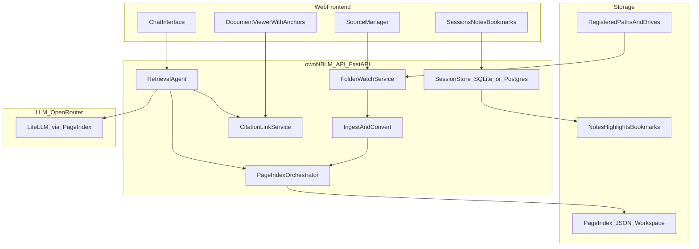
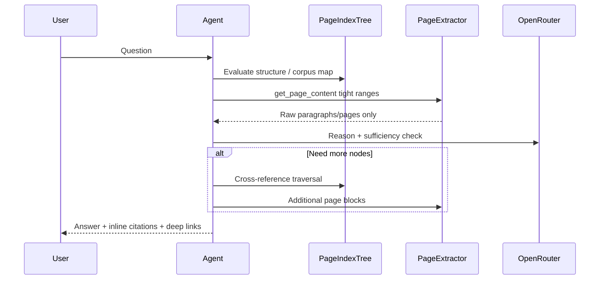
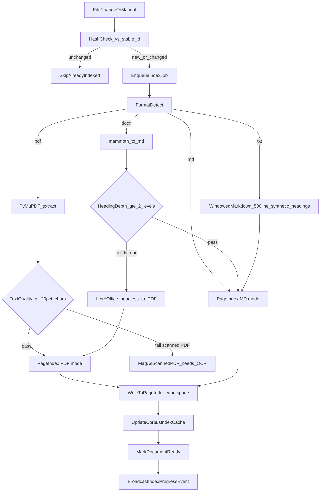

# ownNBLM — NotebookLM-Style Grounded Learning Platform (v2 — Critically Reviewed)

---

## Critical Review: What Was Wrong in V1

Before the revised plan, here are the concrete issues found by reading the actual PageIndex source code that would have caused the project to fail silently or require major rework mid-build.

### Blocker 1: openai-agents SDK does not route to OpenRouter

The original plan said "port the agentic loop from `agentic_vectorless_rag_demo.py`." That demo uses the `openai-agents` Python SDK (`openai-agents` package) which calls OpenAI's API endpoint natively. Your `config.yaml` is already configured with OpenRouter models:

```yaml
model: "openrouter/deepseek/deepseek-v4-flash"
retrieve_model: "openrouter/deepseek/deepseek-v4-flash"
```

`PageIndexClient._normalize_retrieve_model` turns this into `litellm/openrouter/deepseek/deepseek-v4-flash`. When this is passed as `model` to the `openai-agents` `Agent()` constructor, the SDK tries to call it against `https://api.openai.com/v1` with no `litellm/` prefix stripping. This silently fails or throws an authentication error at runtime — not a compile-time error, so it would only surface after you built the entire UI layer.

**Fix**: Replace the `openai-agents` SDK for the web app's agent loop with a **LiteLLM-native tool-calling loop** (manual message accumulation + `litellm.completion` with `tools=` parameter). This is simpler, provider-agnostic, and already what PageIndex uses internally for indexing. The demo is only useful as a reference for tool design — not for the runtime loop itself.

### Blocker 2: Corpus-level search is NOT in PageIndex OSS

The plan referenced "PageIndex File System layer" (corpus-level reasoning over many docs) as if it were available in the open-source package. It is not. It is a blog post describing a concept. The OSS `PageIndexClient` and `_meta.json` only track per-document workspace metadata (doc name, path, page count). There is no cross-document keyword pre-filter, no corpus description aggregation, and no `list_corpus` or `search_corpus` tool.

The entire corpus-query mode (Mode 1) therefore requires building a custom `CorpusIndex` layer from scratch in ownNBLM — not just "wiring" something that exists. This is one of the larger engineering pieces in the project.

### Blocker 3: Indexing cost and time is far higher than stated

The plan said "files auto-index within minutes." Each `page_index()` call on a PDF makes many sequential LLM API calls: title-appearance checks, section boundary detection, TOC extraction, summary generation per node. For a 200-page PDF, this can be 30–80 LLM calls with OpenRouter at ~1–2s/call = 1–2 minutes per document, not counting retries. The `max_retries=10` with `time.sleep(1)` in `llm_completion` means a single bad call blocks for 10 seconds. For a folder with 20 documents, first-time indexing is realistically 20–40 minutes, not "a few minutes."

**Implications**: (a) Indexing must be fully async and backgrounded with per-document progress tracking. (b) Re-index on every file change would be catastrophic — needs content-hash gating. (c) API cost estimation must be surfaced to users before they trigger a full corpus index. (d) Phase 1 success criteria "within minutes" needs to be revised.

### Blocker 4: DOCX heading hierarchy is not guaranteed

`mammoth` preserves headings **only** when the Word document uses built-in Word Heading Styles (Heading 1, Heading 2, etc.). Real-world DOCX files frequently use bold text, manual indentation, or custom styles instead of semantic heading styles. `mammoth` converts these as plain paragraphs → flat Markdown → `md_to_tree` produces a near-useless single-node tree → retrieval quality collapses. The plan listed this as a risk but the mitigation ("mammoth with heading preservation") is insufficient.

**Fix**: Add a post-conversion heading quality check. If the converted MD has fewer than 3 heading levels, fall back to LibreOffice-rendered PDF (preserving visual hierarchy) → PageIndex PDF mode instead. LibreOffice headless must be a declared system dependency.

### Gap 5: No testing strategy

The plan had zero mention of tests. For a retrieval application where correctness is the core value proposition, the absence of a test strategy means every deployment is a trust-and-pray exercise. See the Testing Strategy section below for what is required.

### Gap 6: No streaming protocol defined

"Streaming answers" appeared in the plan but the protocol was not defined. The agent loop is async; the browser needs SSE (Server-Sent Events) from a FastAPI `StreamingResponse`. The events need structure (text delta, tool call started, citation ready, error) — not just raw text. This protocol design must happen before the frontend and backend are built separately.

### Gap 7: doc_id is not stable across file moves or renames

`PageIndexClient.index()` generates a new UUID `doc_id` every time a file is indexed. If a user moves or renames a document, the watchdog re-indexes it with a new `doc_id`, breaking all session references, bookmarks, and annotations pointing to the old `doc_id`. The fix is to use a **content-hash-derived stable ID** (SHA-256 of first 64KB of file content) as the primary identity, with UUID as the workspace storage key only.

### Gap 8: Conversation history context limit not managed

The `messages` table stores chat history but there is no plan for what happens when conversation history exceeds the LLM's context window. A long learning session with cited page content injected per turn will easily hit 128K tokens. Need a sliding window strategy: keep last N turns + always include the system prompt + current citations.

### Gap 9: No production operational requirements

No logging, no health check endpoint, no rate limiting for OpenRouter calls, no backup of SQLite, no graceful shutdown of watchdog threads, no cost monitoring. These are not Phase 4 concerns — they must be in Phase 1 so the first deployed version is actually stable.

---

## Starting point (unchanged)

[`ownNBLM/chat context - requirement gathering.md`](c:\Users\mayur\Downloads\AppDevelopment\ownNBLM\chat context - requirement gathering.md) defines the retrieval philosophy: no vector DB, hierarchical tree search, on-demand page extraction, multi-hop sufficiency loop.

[`../PageIndex`](c:\Users\mayur\Downloads\AppDevelopment\PageIndex) is the indexing engine. Use it as an **editable install** (`pip install -e ../PageIndex`). The relevant internals:

- `pageindex/client.py` — `PageIndexClient`: index + retrieve per document
- `pageindex/retrieve.py` — `get_document`, `get_document_structure`, `get_page_content`: the three tools
- `pageindex/utils.py` — `llm_completion` / `llm_acompletion` via LiteLLM with 10-retry loop
- `pageindex/config.yaml` — already uses `openrouter/deepseek/deepseek-v4-flash`; LiteLLM handles OpenRouter routing natively

[`SurfSense`](c:\Users\mayur\Downloads\AppDevelopment\SurfSense) is UX reference only — its Neo4j/vector stack is out of scope.

---

## Revised product architecture



### Two query modes (your core UX split)

| Mode | User action | Agent scope | Index used |
|------|-------------|-------------|------------|
| **Corpus Query** | Ask across all registered folders/drives | Full corpus meta-index + per-doc trees | PageIndex File-System layer: lightweight `_meta.json` corpus map → route to doc → tree search |
| **Scoped Session** | Pick N documents → open dedicated chat | Fixed doc_id set for session lifetime | Same tools, but agent tools filtered to session's doc list; multiple parallel sessions allowed |

Both modes share the same retrieval loop described in your chat context:



---

## Revised tech stack

| Layer | Choice | Rationale |
|-------|--------|-----------|
| Backend | **Python 3.11+ FastAPI** | Same language as PageIndex; async streaming; easy Windows + Linux deploy |
| Retrieval core | **PageIndexClient** editable install from `../PageIndex` | Index PDF + MD; three retrieval tools wired directly |
| Agent loop | **LiteLLM-native tool loop** (NOT openai-agents SDK) | Works with every provider via one interface; avoids Blocker 1 |
| LLM — Phase 1 | **OpenRouter** via `litellm.acompletion(tools=[...])` | Already configured in `config.yaml`; swap model without code change |
| LLM — Phase 2+ | **Multi-provider**: Ollama, OpenRouter, OpenAI, Anthropic, Groq, Azure OpenAI, any custom OpenAI-compatible endpoint | LiteLLM provider string is the only change per provider; stored in DB settings table |
| Ollama support | Auto-detect at `localhost:11434`; model list from `/api/tags`; no key needed | Fully offline/private mode when Ollama is running locally |
| Corpus index | **Custom `CorpusIndex` class** in ownNBLM | Not in PageIndex OSS — built here |
| Local DB | **SQLite + WAL mode** | Sources, docs, sessions, jobs, annotations, settings; Alembic from day 1 |
| Cloud DB | **PostgreSQL** (same Alembic migrations, same SQLAlchemy models) | Drop-in by changing `OWNNBLM_DB_URL` |
| File watch | **watchdog** + 60s polling fallback | External/removable drives on Windows need polling |
| DOCX ingest | **mammoth** → heading-depth gate → **LibreOffice headless fallback** | Quality gate prevents flat-tree disaster |
| TXT ingest | Windowed MD sectioning (500-line synthetic headings) | Feeds `md_to_tree` |
| Streaming | **FastAPI SSE** `text/event-stream` with typed events | `EventSource` in browser; no library |
| PDF viewer | **PDF.js** (React wrapper `react-pdf`) | In-browser; scroll-to-page anchor from citations |
| Frontend | **React + Vite** | `react-markdown` + `remark-gfm` + **Mermaid.js** + **Recharts** |
| Theming | **CSS variables** with system-preference dark/light detect | `prefers-color-scheme`; user toggle stored in localStorage |
| Logging | **structlog** JSON | Works locally and cloud; machine-readable |
| Migrations | **Alembic** | SQLite and Postgres share identical migration files |
| Deploy local | `ownnblm serve` CLI (uvicorn + static build) | Single command; no Docker required locally on Windows |
| Deploy cloud | **Docker Compose** (`api` + `nginx` + optional `postgres`) + **Caddy** | 2–4 GB VPS; TLS via Caddy auto-certs |

**LLM provider strategy**: Phase 1 ships with OpenRouter only to keep scope tight. Phase 2 adds the full Provider Config UI. The agent loop code never changes — only the LiteLLM model string + api_base stored in the `settings` DB table changes per provider. This means the system is architecturally provider-agnostic from day 1, and the UI layer for configuration is the only Phase 2 addition.

**Grimmory is not used.** Built-in Source Registry replaces it.

---

## Data model (v3 — complete with new features)

**sources** — `id`, `path`, `label`, `watch_enabled`, `poll_interval_s`, `last_scan_at`, `created_at`

**documents** — `doc_id` (UUID workspace key), `stable_id` (SHA-256 first 64KB), `source_id` FK, `relative_path`, `format`, `index_status` (pending/indexing/ready/error/stale), `file_hash`, `mtime`, `page_count`, `doc_name`, `doc_description`, `doc_summary_bullets` (JSON 3-item array — auto-generated at index time), `indexed_at`, `index_error`

**sessions** — `session_id`, `name` (auto-named from first query if not set), `mode` (`corpus`|`scoped`), `template` (`deep_study`|`quick_answer`|`teach_me`|`compare`), `created_at`, `last_active_at`

**session_docs** — `session_id + stable_id` join table

**messages** — `message_id`, `session_id`, `role`, `content` (markdown), `citations` (JSON), `confidence` (`high`|`partial`|`not_found`), `confidence_reason` (string), `token_count`, `created_at`

**annotations** — `annotation_id`, `session_id`, `stable_id`, `anchor_start`, `anchor_end`, `type` (`note`|`highlight`|`bookmark`), `content`, `color`, `created_at`

**index_jobs** — `job_id`, `stable_id`, `triggered_by`, `status`, `started_at`, `finished_at`, `error`, `llm_calls_made`, `estimated_cost_usd`, `actual_cost_usd`

**corpus_index_cache** — `stable_id`, `doc_description`, `node_summaries` (JSON), `last_updated_at`

**settings** — `key`, `value` (JSON) — stores: `llm_provider` (`openrouter`|`ollama`|`openai`|`anthropic`|`groq`|`azure`|`custom`), `indexing_model`, `retrieval_model`, `api_key` (encrypted at rest), `api_base` (for Ollama/custom), `watch_intervals`, `indexing_concurrency`, `libreoffice_path`, `theme` (`system`|`light`|`dark`)

Token-window rule: context = system_prompt_for_template + last N messages where total tokens ≤ 80% of provider's declared context window; context window stored per model in a bundled `models.json` manifest; Ollama models query `/api/show` for context length.

---

## Ingest pipeline (revised with quality gates)



- **Re-index trigger**: `stable_id` (content hash) changes — not just mtime; mtime as secondary shortcut
- **Async queue**: all indexing runs in a background `asyncio` task; FastAPI SSE broadcasts progress events (`indexing_started`, `indexing_progress`, `indexing_done`, `indexing_error`) so UI shows live status
- **Cost estimate**: before starting, calculate estimated LLM calls = `ceil(pages / max_page_num_each_node)` × 3; surface as "~$X, ~Y minutes" in UI before confirming
- **External drives (Windows)**: register `D:\`, `E:\` as source roots; use 60s polling; detect drive disconnect gracefully
- **Concurrency limit**: max 2 documents indexing simultaneously to avoid OpenRouter rate-limit exhaustion

---

## Agent loop design (LiteLLM-native)

The agent loop replaces the `openai-agents` SDK. All providers including OpenRouter work because LiteLLM handles routing natively.

```python
# Pseudocode — ownNBLM backend/agent/loop.py
async def run_agent(session, question, on_event):
    tools = build_tools(session)   # scoped to session.doc_ids or full corpus
    messages = load_windowed_history(session) + [{"role":"user","content":question}]

    while True:
        response = await litellm.acompletion(
            model=settings.OPENROUTER_MODEL,
            messages=messages,
            tools=tools,
            stream=True
        )
        async for chunk in response:
            if chunk is text_delta:  await on_event("text_delta", chunk.text)
            if chunk is tool_call:
                result = await dispatch_tool(chunk.tool_name, chunk.tool_args)
                await on_event("tool_call", {name, args, result})
                messages.append(tool_result_message(result))
        if no_more_tool_calls or hop_count >= MAX_HOPS:
            break
    await on_event("citations", extract_citations(messages))
    await on_event("done", None)
```

**Tools available to the agent:**

For both modes (corpus + scoped):
- `get_document_structure(doc_id)` — tree map without text (from `pageindex/retrieve.py`)
- `get_page_content(doc_id, pages)` — tight range extraction (from `pageindex/retrieve.py`)
- `get_document(doc_id)` — doc metadata

Corpus-mode only (built in ownNBLM, NOT in PageIndex OSS):
- `list_corpus()` — all `ready` docs with `doc_id`, `doc_name`, `doc_description`, `source_label`
- `search_corpus_hints(query)` — fuzzy match over `corpus_index_cache`; returns ranked doc_id list

**Circuit breaker**: `MAX_HOPS` = 8 for `deep_study`, 3 for `quick_answer`, 6 for `teach_me`/`compare`. Exceeding returns partial answer flagged as `confidence=partial`.

**Confidence scoring**: after the loop completes, the agent emits a self-assessment:
- `high` — all sub-questions answered with direct page citations
- `partial` — some sub-questions answered; others lacked source material
- `not_found` — no relevant content found in any indexed document

**Thinking narrative**: each tool call maps to a user-visible narrative string (not the raw tool name):

```python
THINKING_NARRATIVES = {
    "list_corpus": "Scanning available documents...",
    "search_corpus_hints": "Identifying relevant documents...",
    "get_document_structure": "Reading {doc_name} structure...",
    "get_page_content": "Reading pages {pages} of {doc_name}...",
    "_cross_reference": "Following cross-reference to {target}...",
    "_sufficiency_check": "Verifying answer completeness...",
}
```

These are emitted as `thinking_update` SSE events before each tool call fires.

## SSE streaming protocol (extended)

FastAPI endpoint: `POST /api/sessions/{session_id}/chat` with `{"question": "..."}` body; response is `text/event-stream`.

Typed event schema (all JSON-encoded in `data:` field):

```
event: thinking_update  data: {"message": "Scanning available documents..."}
event: text_delta       data: {"delta": "..."}
event: tool_call        data: {"name": "get_page_content", "doc_name": "Q1 Report", "pages": "44-48"}
event: citation         data: {"stable_id":"...", "doc_name":"Q1 Report.pdf", "page_start":44, "page_end":48, "excerpt":"...", "deep_link":"/viewer/{stable_id}?page=44", "citation_num": 1}
event: confidence       data: {"level": "high", "reason": "Found in 3 sources with direct citations"}
event: error            data: {"code": "rate_limit"|"provider_down"|"no_index"|"context_exceeded", "message": "..."}
event: done             data: {"total_hops": 3, "token_count": 1240, "estimated_cost_usd": "0.0041"}
```

Frontend: `const es = new EventSource(url)` — no library. Handler maps `thinking_update` → progress narrative bar; `text_delta` → chat bubble streaming; `citation` → inline `[N]` superscript injection + chip below; `confidence` → badge on response; `done` → enable input.

## Citation design

Every citation uses `stable_id`. Pattern: inline numbered superscripts in response text + chips summary below.

```
Response text: "The revenue grew 23% in Q3 [1], driven primarily by new market expansion [2]."

[1] Q1 Report.pdf · p44–48  [open ↗]
[2] Strategy Deck.pdf · p12  [open ↗]
```

- Hover `[1]` → tooltip shows excerpt (first 150 chars of cited page content)
- Click `[1]` or chip → opens viewer pane scrolled to that page; highlights the cited paragraph
- Viewer route: `/viewer/{stable_id}?page=44&highlight=sentence_hash`
- Download: `GET /api/docs/{stable_id}/file?token=<jwt_15min>` via `python-jose`

**Grounding visual language** (three response segment types, distinguished by left-border colour):
- Solid green border — paragraph directly cited with page reference
- Dashed amber border — synthesised from multiple sources (no single page)
- Grey/dashed border — model inference; no document source (shown with ⚠ icon)

This grounding visual language is the primary UX differentiator — users see exactly what is grounded vs inferred.

---

## UI/UX specification (CX-reviewed)

### Layout: Adaptive 2-panel (chat-dominant)

```
┌──────────────────────────────────────────────────────────────────────┐
│  [≡ Sources]  ownNBLM  [All Sources ▼ | + New Session]  [⚙ Settings] │  ← Header bar
├──────────────────────────────────────────────────────────────────────┤
│ ◀ Sources         │                                    │ Viewer ▶    │
│  (collapsible,    │         CHAT PANEL                 │ (collapsible│
│   240px default)  │   (always centre-dominant,         │  370px)     │
│                   │    grows on sidebar collapse)      │             │
│ ─ Sources ─       │                                    │  PDF.js or  │
│  📁 Research/     │  [assistant bubble with            │  MD render  │
│   ✅ report.pdf   │   grounding visual]                │  at cited   │
│   ⏳ notes.docx   │                                    │  page       │
│   ❌ scan.pdf⚠    │  [user bubble]                     │             │
│                   │                                    │             │
│ ─ Annotations ─   │  [thinking bar: "Reading p44-48…"] │             │
│   📌 3 bookmarks  │                                    │             │
│   🖊 1 note        │  [streaming assistant bubble]      │             │
│                   │  [citation chips [1] [2]]          │             │
│                   │                                    │             │
│                   │  ┌─────────────────────────────┐  │             │
│                   │  │ Ask anything... [Template ▾]│  │             │
│                   │  └─────────────────────────────┘  │             │
└───────────────────┴────────────────────────────────────┴─────────────┘
```

Breakpoints:
- Wide (≥1440px): both sidebars open by default
- Laptop (1024–1439px): Sources open, Viewer closed (opens on citation click)
- Tablet (768–1023px): both sidebars closed; icon rail for toggle
- Mobile (<768px): tab bar at bottom (Chat / Sources / Viewer / Notes)

### First-launch onboarding wizard

Shown when `settings` table has no `llm_provider` set yet. 3 steps:

1. **"Add your first folder"** — large drag-and-drop target + "Browse folder" button (uses backend `GET /api/os/folder-picker` which opens native OS dialog via `tkinter.filedialog` on Windows/Linux or `osascript` on Mac). Path shown, label editable.
2. **"Preview what was found"** — file list with format icons; estimated indexing time + cost shown. "Index now" CTA + "Skip, I'll index later" option.
3. **"Try a sample question"** — bundled `sample_research.pdf` (a CC-licensed paper) always available as a demo source; first question pre-suggested: "What is the main contribution of this paper?" User sees the full Q&A → citation → viewer flow working before they've indexed anything personal.

After wizard, user lands in Chat panel with corpus mode active. Wizard never shown again.

### Empty states (every panel needs one)

- Sources panel empty: illustration + "Add a folder or drive to get started" + Browse button
- Chat panel — no sources: "No documents indexed yet. Add a folder in Sources →"
- Chat panel — sources indexing: "Documents are being indexed (3/8 done). You can chat once indexing is complete."
- Chat panel — corpus ready: "Your library is ready. Ask anything across all your documents."
- Annotations rail empty: "Save highlights and notes during a session. Select text in the viewer to get started."

### Thinking progress narrative (replaces spinner)

While agent is running, a collapsible progress bar appears below the user message:

```
  ┌─ Thinking ──────────────────────────────────────────────────────── ▾ ┐
  │  ✔ Identified relevant documents (3 found)                            │
  │  ✔ Reading Q1 Report.pdf structure...                                 │
  │  ⏳ Reading pages 44–48 of Q1 Report.pdf...                           │
  │  ○ Verifying answer completeness...                                   │
  └───────────────────────────────────────────────────────────────────────┘
```

Steps appear sequentially as `thinking_update` SSE events arrive. Collapsible (default open). On completion, collapses to a single line "Checked 3 documents, 4 sources" with expand option.

### Session template selector

In the chat input row, a Template dropdown:

```
[Deep Study ▾]  → Deep Study | Quick Answer | Teach Me | Compare
```

Templates change system prompt prefix and MAX_HOPS. Visual cue: input bar border colour changes per template.

### Answer confidence badge

Every completed assistant response shows:

```
  🟢 High confidence — found in 3 sources      or
  🟡 Partial answer — only 1 source found      or  
  🔴 Not found in documents
```

Tapping/clicking the badge expands a brief explanation: "I found supporting information on pages 44–48 of Q1 Report and pages 12–14 of Strategy Deck."

### Document summary cards in Sources panel

Each indexed document shows a summary card:

```
  📄 Q1 Report.pdf    ✅ Ready  [⋯]
  • Revenue grew 23% YoY driven by new markets
  • Operating margin compressed due to R&D investment
  • Guidance raised for FY26 full year
  [▾ View document structure]   [💬 Chat about this]
```

"Chat about this" creates a new scoped session with just that document.
"View document structure" expands the PageIndex tree hierarchy inline.

### Settings panel (Phase 1 — OpenRouter)

```
LLM Provider:  [ OpenRouter ▾ ]
API Key:       [●●●●●●●●●●●●●●] [Test Connection]  → shows "✔ Connected" or "✘ Error: ..."
Indexing model:   [ deepseek/deepseek-v4-flash ▾ ]  (~$0.001/doc estimated)
Retrieval model:  [ anthropic/claude-sonnet-4-5 ▾ ]

Watch interval (external drives):  [ 60s ▾ ]
Max concurrent indexing jobs:      [ 2 ▾ ]
LibreOffice path:  [/usr/bin/soffice        ] [Auto-detect]
Theme:             [ System ▾ ]  (System / Light / Dark)
```

Phase 2 Settings adds a Provider selector that exposes per-provider fields (no API key for Ollama, api_base for custom).

### Keyboard shortcuts

| Shortcut | Action |
|----------|--------|
| `Ctrl+K` | New session |
| `Ctrl+/` | Focus Sources panel |
| `Ctrl+J` | Jump to next citation in current response |
| `Ctrl+Shift+B` | Create bookmark from current viewer position |
| `Ctrl+F` | Search within current session messages (Phase 2) |
| `Esc` | Close viewer pane / dismiss modal |
| `Enter` | Submit question (Shift+Enter for newline) |

### Rich output conventions (agent system prompt directives)

- Tables: GFM markdown `|` tables
- Charts: fenced ` ```chart ` with Recharts JSON spec → rendered by frontend
- Concept maps: fenced ` ```mermaid ` → Mermaid.js renderer
- Callouts: `> **📌 Key point:**` → styled callout box
- Comparisons (in `compare` template): `> **Doc A vs Doc B**` table structure instructed in system prompt

---

## LLM provider configuration

### Phase 1 — OpenRouter only (bootstrap from `.env`)

Backend `.env` (documented in `.env.example`, never committed):

```
OPENROUTER_API_KEY=sk-or-v1-...
OWNNBLM_INDEXING_MODEL=openrouter/deepseek/deepseek-v4-flash
OWNNBLM_RETRIEVAL_MODEL=openrouter/anthropic/claude-sonnet-4-5
OWNNBLM_DB_URL=sqlite:///${USERPROFILE}/.ownnblm/ownnblm.db
OWNNBLM_WORKSPACE_DIR=${USERPROFILE}/.ownnblm/workspace
```

LiteLLM handles routing: `OPENROUTER_API_KEY` env var is picked up automatically for `openrouter/...` model paths. The `utils.py` `llm_completion` strips `litellm/` before calling LiteLLM — our agent loop passes model strings directly without prefix.

### Phase 2 — Multi-provider settings stored in DB

The `settings` table stores the active provider config as JSON. The backend `ProviderConfig` class constructs the LiteLLM call kwargs:

```python
# backend/agent/provider.py
class ProviderConfig:
    provider: str          # "openrouter" | "ollama" | "openai" | "anthropic" | "groq" | "azure" | "custom"
    indexing_model: str    # e.g. "openrouter/deepseek/deepseek-v4-flash" or "ollama/llama3.2"
    retrieval_model: str
    api_key: str | None    # None for Ollama; encrypted at rest with Fernet
    api_base: str | None   # "http://localhost:11434" for Ollama; custom endpoint URL
    context_window: int    # fetched from bundled models.json or Ollama /api/show
```

LiteLLM call: `litellm.acompletion(model=config.retrieval_model, api_base=config.api_base, api_key=config.api_key, tools=[...])`. No other code changes when provider changes.

### Ollama-specific handling

- Auto-detect: on startup, `GET http://localhost:11434/api/tags` → if 200, mark Ollama as available
- Model list: populated from `/api/tags` response; shown in model selector dropdown
- Context window: `POST /api/show {"name": model_name}` returns `context_length`
- No API key field shown in Settings when Ollama is selected
- Performance warning if selected model parameter count < 7B: "Small models may give poor multi-hop retrieval results. Recommend 13B+ for best quality."

### Provider compatibility matrix (bundled `models.json`)

```json
{
  "openrouter/deepseek/deepseek-v4-flash": {"context_window": 163840, "tool_calling": true},
  "openrouter/anthropic/claude-sonnet-4-5": {"context_window": 200000, "tool_calling": true},
  "ollama/llama3.2": {"context_window": 128000, "tool_calling": true},
  "ollama/qwen2.5:7b": {"context_window": 131072, "tool_calling": true}
}
```

Unknown models default to `context_window: 32000` with a warning in UI.

---

## Cross-device sync architecture

This section answers the question: "Documents are on my Windows machine — how does my phone, tablet, and second laptop see the same corpus and continue the same sessions?"

### The architectural principle

There is exactly one source of truth: the **cloud ownNBLM instance**.

- **Documents** travel one-way: local machine → cloud (via `ownnblm-sync` daemon or cloud storage connectors). Once on the cloud, they are stored, indexed, and served from there.
- **Sessions, messages, citations, annotations** live in the cloud Postgres database. Every device hitting `https://your.ownnblm.com` reads and writes to the same database row. There is nothing to sync — it is shared by definition.
- **On non-Windows devices** (phone, tablet, second laptop): the PDF/DOCX viewer is PDF.js running in the browser. The file is streamed from the cloud VPS via signed URL. No local file access is needed.

```
┌──────────────────────────────────────────────────────────────────────────┐
│                       CLOUD ownNBLM VPS                                  │
│                                                                          │
│  ┌──────────────┐  ┌──────────────────┐  ┌────────────────────────────┐ │
│  │  Postgres    │  │  /data/docs/     │  │  PageIndex Workspace       │ │
│  │  sessions    │  │  (all uploaded   │  │  (JSON index trees)        │ │
│  │  messages    │  │   docs live here)│  │  per document              │ │
│  │  annotations │  └──────────────────┘  └────────────────────────────┘ │
│  └──────────────┘                                                        │
│  ┌───────────────────────────────────────────────────────────────────┐   │
│  │  FastAPI backend                                                   │   │
│  │  /api/sync/*   /api/connectors/*   /api/docs/*   /api/sessions/*  │   │
│  └───────────────────────────────────────────────────────────────────┘   │
└────────────────────────┬──────────────────────────────────────────────┘
                         │ HTTPS
          ┌──────────────┼──────────────────────────────────┐
          │              │                                  │
          ▼              ▼                                  ▼
┌──────────────────┐  ┌──────────────────┐  ┌───────────────────────────┐
│ Windows Desktop  │  │ Cloud Storage    │  │ Any Browser Client        │
│                  │  │                  │  │ (phone/tablet/             │
│ ownnblm-sync     │  │ OneDrive ──────► │  │  MacBook/second laptop)   │
│ daemon           │  │ Google Drive ──► │  │                           │
│ (Windows service)│  │ Dropbox ───────► │  │ Reads/writes same         │
│                  │  │  connectors pull │  │ Postgres rows             │
│ Watches:         │  │  on schedule     │  │ Views PDFs via PDF.js     │
│  C:\Research\    │  └──────────────────┘  │ streamed from cloud       │
│  D:\Books\       │                        │                           │
│  E:\Archives\    │                        │ No local file access      │
│                  │                        │ needed ever               │
│ Uploads changed  │                        └───────────────────────────┘
│ files via HTTPS  │
└──────────────────┘
```

### ownnblm-sync desktop agent

A lightweight background process, part of the ownNBLM package (`ownnblm-sync` command):

```
Local machine (Windows/Mac/Linux)
  ownnblm-sync daemon:
    1. Reads ~/.ownnblm/sync.json  ← cloud_url, api_key, watched_paths
    2. Watches paths with watchdog (same library as backend)
    3. On file change:
       a. Compute stable_id (SHA-256 first 64KB)
       b. GET /api/sync/status/{stable_id}  ← already on cloud?
       c. If not present or hash changed:
          - Files < 25MB:  POST /api/sync/upload (multipart)
          - Files ≥ 25MB:  POST /api/sync/upload-url → presigned PUT → PUT direct
       d. Cloud stores file → triggers index job → SSE notifies all open browsers
    4. Polls /api/sync/status every 60s for confirmation
    5. Logs to ~/.ownnblm/sync.log
```

**Installation on Windows:**

```bash
pip install ownnblm          # installs ownnblm-sync CLI tool
ownnblm-sync configure       # interactive: enter cloud URL + API key + watched folders
ownnblm-sync install-service # registers as Windows service (uses pywin32)
ownnblm-sync status          # check what's been synced and what's pending
```

The Windows service runs on login, uses idle CPU, and is configurable for bandwidth throttling (config: `max_upload_mbps`, `skip_hours` to pause during business hours).

**Resumable uploads** — interrupted uploads are tracked in `sync_uploads` table on the cloud. If upload is interrupted, next sync attempt resumes from last successful chunk (content-range headers).

**Document deletion policy (critical for user trust):**

When a local file is deleted, the sync agent does NOT auto-delete from cloud. Reason: sessions and annotations reference the document. Instead:
- Sync agent marks `documents.sync_status = local_deleted`
- UI shows orange warning icon: "Original deleted from Windows — kept in cloud corpus"
- User can choose in UI: "Keep in corpus" or "Remove + delete all session references"
- Manual add via browser (drag-drop or file picker) always available

### Cloud storage connectors

Each connector implements a standard `ConnectorBase` interface:

```python
class ConnectorBase:
    async def list_files(self) -> list[RemoteFile]   # file_id, name, modified_at, size
    async def download_file(file_id: str) -> bytes
    async def register_webhook(callback_url: str)    # for real-time push
    async def refresh_token(self)                    # OAuth2 token refresh
```

Phase 2 connectors:
- **OneDrive** (Microsoft Graph API) — highest priority for Windows users
- **Google Drive** (Drive API v3)
- **Dropbox** (Dropbox API v2)

Auth flow: user clicks "Connect OneDrive" in Settings → OAuth2 PKCE redirect → access token + refresh token stored encrypted in `settings` table with `cryptography.fernet` → periodic token refresh before expiry.

Sync schedule per connector: configurable (default: every 30 minutes). Webhook registration attempted first (faster); falls back to polling if webhook not supported.

Files downloaded from cloud storage go through the same ingest pipeline (same quality gates, same DOCX fallback, same index jobs).

### Real-time updates across all open devices

When a file is indexed (via sync agent or connector), all open browser sessions need to reflect the new corpus immediately.

Phase 1–3 mechanism — DB-backed event polling (no extra dependencies):
```
Backend: on index complete → write to events table {user_id, type: "source_updated", payload}
Frontend: poll GET /api/events/stream (long-polling, 10s timeout) → on source_updated → refresh Sources panel
```

Phase 4 mechanism — Server-Sent Events per user:
```
GET /api/users/{id}/events (persistent SSE connection)
→ backend pushes source_updated, index_progress, connector_synced events in real time
→ Sources panel auto-refreshes; no polling needed
```

### Data model additions for sync

**sync_clients** — one row per device running ownnblm-sync:

`client_id`, `user_id`, `client_name`, `device_os`, `api_key` (bcrypt hash), `last_sync_at`, `last_seen_ip`, `total_uploads`, `created_at`, `revoked_at`

**connectors** — one row per cloud storage integration per user:

`connector_id`, `user_id`, `type` (`onedrive`|`gdrive`|`dropbox`), `display_name`, `access_token` (Fernet encrypted), `refresh_token` (Fernet encrypted), `token_expires_at`, `root_folder_id`, `sync_interval_min`, `last_sync_at`, `total_files_synced`, `status` (`active`|`paused`|`error`), `error_message`

**sync_uploads** — tracks individual file upload jobs:

`upload_id`, `client_id`, `stable_id`, `original_filename`, `original_path` (local path), `size_bytes`, `chunks_uploaded`, `total_chunks`, `status` (`pending`|`in_progress`|`done`|`failed`), `started_at`, `completed_at`, `error`

**documents table additions:**

`sync_source` (`local_sync`|`onedrive`|`gdrive`|`dropbox`|`manual_upload`|`watched_path`), `connector_id` FK (nullable), `sync_client_id` FK (nullable), `original_device_path` (e.g. `C:\Research\Q1.pdf`), `sync_status` (`synced`|`local_deleted`|`remote_only`|`conflict`)

### Cross-device user experience (day-in-the-life)

```
Morning: User on Windows desktop
  → ownnblm-sync runs in background, detects 3 new PDFs added to C:\Research\
  → Uploads all 3 to cloud (2 min each for 100-page PDFs)
  → Indexing completes; all open ownNBLM browser tabs refresh automatically

Lunch: User on iPhone browser at https://ownnblm.yourdomain.com
  → Sees the 3 new documents in Sources panel (synced this morning)
  → Asks a question → answer with citations from 2 of the 3 new PDFs
  → Saves 2 bookmarks from the answer
  → Switches to a different session → full history loads instantly

Evening: User back on Windows desktop browser
  → Opens the iPhone session → full message history including lunch annotations
  → Asks follow-up questions → agent has full context of previous conversation
  → Adds note to one of the iPhone bookmarks from the desktop

Next day: User on tablet
  → Logs in → sees all 3 sessions from yesterday
  → Corpus has 5 new documents (OneDrive connector synced overnight from shared team folder)
  → Starts a scoped session with just those 5 new docs
  → Chat history persists across tablet sessions
```

### What is explicitly NOT supported (and why)

| Not supported | Why | Alternative |
|---|---|---|
| Editing documents on cloud from the UI | ownNBLM is a read/query tool, not a document editor | User edits locally; sync agent re-uploads |
| Real-time collaborative chat (two people typing in same session) | Phase 4 scope; requires WebSocket | Each user has their own sessions; sessions are shareable read-only |
| Syncing session data back to local ownnblm | Cloud is the single source; two DBs = conflicts | Use cloud URL for all devices |
| Automatic offline mode | No local index on non-Windows devices | Offline mode is Phase 5 (Progressive Web App + local IndexedDB cache) |
| Bi-directional file sync (cloud → local) | Unnecessary — documents flow one way | Download via signed URL if needed |

### Sync security model

- Each sync client authenticates with a **per-device API key** (not the user's login password)
- Keys are generated in Settings → "Sync Clients" → "Add new device"
- Keys can be revoked individually (e.g., if a Windows machine is lost)
- All uploads go over HTTPS; files stored on VPS are not encrypted at rest in Phase 1 (encryption at rest in Phase 4)
- OAuth2 tokens for cloud storage connectors are encrypted with Fernet using a per-user key derived from `SECRET_KEY + user_id`
- File contents are never logged (only filenames, sizes, stable_ids in logs)

---

## Docker integration strategy

### Key constraint: PageIndex has no pip packaging

PageIndex (`../PageIndex`) has no `setup.py` or `pyproject.toml` — it cannot be `pip install`-ed from GitHub directly. Its `pageindex/` subdirectory is a proper Python package (has `__init__.py`) but the repo has no build metadata. This is resolved by vendoring:

- At build time, `scripts/fetch_pageindex.sh` clones PageIndex at a pinned commit into `pageindex_vendor/` inside the ownNBLM repo
- `pageindex_vendor/` is gitignored; re-fetched on each image build; pinned by `PAGEINDEX_COMMIT` variable
- Inside Docker: `pageindex_vendor/` is copied to `/app/pageindex_pkg/` and added to `PYTHONPATH`
- This is independent of the local `../PageIndex` dev install — the image is self-contained

```bash
# scripts/fetch_pageindex.sh
PAGEINDEX_COMMIT=${1:-main}
rm -rf pageindex_vendor && mkdir -p pageindex_vendor
git clone --depth=1 https://github.com/VectifyAI/PageIndex.git --branch $PAGEINDEX_COMMIT /tmp/pi_clone
cp -r /tmp/pi_clone/pageindex pageindex_vendor/pageindex
cp /tmp/pi_clone/requirements.txt pageindex_vendor/requirements.txt
echo "$PAGEINDEX_COMMIT" > pageindex_vendor/COMMIT
rm -rf /tmp/pi_clone
```

### Dockerfile (multi-stage, single final image)

```
Stage 1: frontend-builder  (node:20-alpine)
  → npm ci + npm run build
  → output: /app/frontend/dist/

Stage 2: python-deps-builder  (python:3.11-slim)
  → pip install ownNBLM backend/requirements.txt
  → pip install pageindex_vendor/requirements.txt
  → output: /usr/local/lib/python3.11/site-packages/

Stage 3: runtime  (python:3.11-slim)
  ← copy site-packages from python-deps-builder
  ← copy /dist from frontend-builder
  → apt-get install: libreoffice-writer libreoffice-calc libreoffice-impress
                     fonts-liberation libgl1 libglib2.0-0 tini curl
  → COPY pageindex_vendor/pageindex /app/pageindex_pkg/pageindex
  → COPY backend/ /app/backend/
  → ENV PYTHONPATH=/app/pageindex_pkg
  → VOLUME ["/data", "/docs"]
  → HEALTHCHECK: curl http://localhost:8787/health
  → ENTRYPOINT ["tini", "--"]
  → CMD ["/app/backend/entrypoint.sh"]
```

**Compressed image size estimate:**
- python:3.11-slim base: ~45MB
- System libs (libgl, libglib, curl, tini): ~15MB
- LibreOffice headless (writer+calc+impress, no-install-recommends): ~220MB
- Python packages (fastapi, litellm, pymupdf, alembic, etc.): ~180MB
- PageIndex source: ~1MB
- React static build: ~5MB
- **Total compressed: ~460–490MB**

No Ollama binary in the image. Ollama runs as a separate sidecar service via docker-compose.

### docker-compose.yml (single source of truth for all deployment scenarios)

```yaml
# ownNBLM docker-compose.yml
# Usage:
#   Cloud / OpenRouter only:   docker compose up ownnblm
#   Local Ollama (CPU):        docker compose --profile local up
#   Local Ollama (NVIDIA GPU): docker compose --profile local-gpu up
#   Cloud + TLS:               docker compose --profile cloud up

services:

  ownnblm:
    image: ownnblm/ownnblm:latest  # or build: . for local builds
    container_name: ownnblm
    restart: unless-stopped
    ports:
      - "${HOST_PORT:-8787}:8787"
    env_file: .env
    environment:
      OWNNBLM_PROFILE: ${OWNNBLM_PROFILE:-standard}
      OWNNBLM_PORT: 8787
      OWNNBLM_DB_URL: sqlite:////data/ownnblm.db
      OWNNBLM_WORKSPACE_DIR: /data/workspace
      OLLAMA_HOST: http://ollama:11434   # points to sidecar; no-op if sidecar not running
    volumes:
      - ownnblm_data:/data
      - ${DOCS_PATH:-./sample-docs}:/docs:ro
    healthcheck:
      test: ["CMD", "curl", "-f", "http://localhost:8787/health"]
      interval: 30s
      timeout: 10s
      start_period: 90s
      retries: 3
    depends_on:
      ollama:
        condition: service_healthy
        required: false   # optional — app works without Ollama

  ollama:
    image: ollama/ollama:latest
    container_name: ownnblm-ollama
    restart: unless-stopped
    profiles: [local, local-gpu]
    volumes:
      - ollama_models:/root/.ollama
    healthcheck:
      test: ["CMD", "curl", "-f", "http://localhost:11434/api/tags"]
      interval: 30s
      timeout: 10s
      start_period: 120s
      retries: 5

  ollama-gpu:
    image: ollama/ollama:latest
    container_name: ownnblm-ollama-gpu
    restart: unless-stopped
    profiles: [local-gpu]
    volumes:
      - ollama_models:/root/.ollama
    deploy:
      resources:
        reservations:
          devices:
            - driver: nvidia
              count: all
              capabilities: [gpu]
    healthcheck:
      test: ["CMD", "curl", "-f", "http://localhost:11434/api/tags"]
      interval: 30s
      timeout: 10s
      start_period: 120s
      retries: 5

  caddy:
    image: caddy:2-alpine
    container_name: ownnblm-caddy
    restart: unless-stopped
    profiles: [cloud]
    ports:
      - "80:80"
      - "443:443"
      - "443:443/udp"
    environment:
      OWNNBLM_DOMAIN: ${OWNNBLM_DOMAIN:-example.com}
    volumes:
      - ./Caddyfile:/etc/caddy/Caddyfile:ro
      - caddy_data:/data
      - caddy_config:/config
    depends_on: [ownnblm]

volumes:
  ownnblm_data:    # SQLite DB + PageIndex JSON workspace
  ollama_models:   # Ollama model weights (4–70GB per model)
  caddy_data:
  caddy_config:
```

### .env.example (complete parameter reference)

```bash
# ─── LLM Provider ────────────────────────────────────────────────
# For OpenRouter (Phase 1 default):
OPENROUTER_API_KEY=sk-or-v1-...
OWNNBLM_INDEXING_MODEL=openrouter/deepseek/deepseek-v4-flash
OWNNBLM_RETRIEVAL_MODEL=openrouter/anthropic/claude-sonnet-4-5

# For Ollama sidecar (used with --profile local or --profile local-gpu):
# OWNNBLM_LLM_PROVIDER=ollama
# OWNNBLM_INDEXING_MODEL=ollama/llama3.2
# OWNNBLM_RETRIEVAL_MODEL=ollama/qwen2.5:7b
# OLLAMA_HOST=http://ollama:11434

# For OpenAI, Anthropic, Groq (Phase 2):
# OPENAI_API_KEY=sk-...
# ANTHROPIC_API_KEY=sk-ant-...
# GROQ_API_KEY=gsk_...

# ─── Resource Profile ────────────────────────────────────────────
# nano     — 1 CPU / 512MB RAM / no LibreOffice / concurrency=1
# slim     — 1 CPU / 1GB RAM  / LibreOffice     / concurrency=1
# standard — 2 CPU / 2GB RAM  / LibreOffice     / concurrency=2  ← default
# local    — 4 CPU / 10GB RAM / LibreOffice + Ollama sidecar / concurrency=2
OWNNBLM_PROFILE=standard

# Override individual profile defaults (all optional):
# LIBREOFFICE_ENABLED=true
# INDEX_CONCURRENCY=2
# UVICORN_WORKERS=2
# MAX_HOPS_DEEP_STUDY=8
# MAX_HOPS_QUICK_ANSWER=3

# ─── Paths ───────────────────────────────────────────────────────
DOCS_PATH=/path/to/your/documents      # host path mounted as /docs in container
HOST_PORT=8787

# ─── Cloud deploy ────────────────────────────────────────────────
# OWNNBLM_DOMAIN=yourdomain.com        # used by Caddy for TLS
# OWNNBLM_DB_URL=postgresql://...      # for Postgres (Phase 4)

# ─── Logging ─────────────────────────────────────────────────────
OWNNBLM_LOG_LEVEL=info                 # debug | info | warning | error
```

### entrypoint.sh (runtime bootstrap)

```bash
#!/bin/sh
set -e

# ── Apply resource profile ────────────────────────────────────────
case "${OWNNBLM_PROFILE}" in
  nano)
    LIBREOFFICE_ENABLED=${LIBREOFFICE_ENABLED:-false}
    INDEX_CONCURRENCY=${INDEX_CONCURRENCY:-1}
    UVICORN_WORKERS=${UVICORN_WORKERS:-1}
    ;;
  slim)
    LIBREOFFICE_ENABLED=${LIBREOFFICE_ENABLED:-true}
    INDEX_CONCURRENCY=${INDEX_CONCURRENCY:-1}
    UVICORN_WORKERS=${UVICORN_WORKERS:-1}
    ;;
  standard)
    LIBREOFFICE_ENABLED=${LIBREOFFICE_ENABLED:-true}
    INDEX_CONCURRENCY=${INDEX_CONCURRENCY:-2}
    UVICORN_WORKERS=${UVICORN_WORKERS:-2}
    ;;
  local)
    LIBREOFFICE_ENABLED=${LIBREOFFICE_ENABLED:-true}
    INDEX_CONCURRENCY=${INDEX_CONCURRENCY:-2}
    UVICORN_WORKERS=${UVICORN_WORKERS:-2}
    ;;
esac

export LIBREOFFICE_ENABLED INDEX_CONCURRENCY UVICORN_WORKERS

# ── Check Ollama sidecar availability ────────────────────────────
if curl -s --connect-timeout 2 "${OLLAMA_HOST:-http://ollama:11434}/api/tags" > /dev/null 2>&1; then
    echo "✔ Ollama reachable at ${OLLAMA_HOST}"
    export OLLAMA_AVAILABLE=true
else
    echo "○ Ollama not reachable — local inference disabled"
    export OLLAMA_AVAILABLE=false
fi

# ── Validate LLM provider config ─────────────────────────────────
if [ -z "$OPENROUTER_API_KEY" ] && [ "$OLLAMA_AVAILABLE" = "false" ]; then
    echo "⚠ WARNING: No LLM provider configured. Set OPENROUTER_API_KEY or start Ollama sidecar."
fi

# ── Create data directories ───────────────────────────────────────
mkdir -p /data/workspace

# ── Run database migrations ───────────────────────────────────────
echo "Running Alembic migrations..."
cd /app && python -m alembic upgrade head

# ── Warmup PageIndex ──────────────────────────────────────────────
python -c "
import sys
sys.path.insert(0, '/app/pageindex_pkg')
from pageindex import PageIndexClient
print('✔ PageIndex loaded — commit:', open('/app/pageindex_pkg/COMMIT').read().strip())
"

# ── Start uvicorn ──────────────────────────────────────────────────
echo "Starting ownNBLM (profile=${OWNNBLM_PROFILE}, workers=${UVICORN_WORKERS})..."
exec uvicorn backend.api.main:app \
    --host 0.0.0.0 \
    --port "${OWNNBLM_PORT:-8787}" \
    --workers "${UVICORN_WORKERS}" \
    --log-config /app/backend/log_config.json \
    --no-access-log
```

### Resource profiles in detail

| Profile | OWNNBLM_PROFILE | RAM (container) | CPU (container) | LibreOffice | Index concurrency | Uvicorn workers | Ollama sidecar | Typical use |
|---------|-----------------|-----------------|-----------------|-------------|-------------------|-----------------|----------------|-------------|
| nano | `nano` | 256–512MB | 0.5–1 | disabled | 1 | 1 | no | Cloud VPS 512MB, cost-sensitive |
| slim | `slim` | 512MB–1GB | 1 | enabled | 1 | 1 | no | Cloud VPS 1GB, DOCX support |
| standard | `standard` | 1–2GB | 2 | enabled | 2 | 2 | no | Cloud VPS 2GB, production baseline |
| local | `local` | 2GB (app) + 6–10GB (Ollama) | 4 | enabled | 2 | 2 | yes | Home server / developer machine |
| local-gpu | `local` | 2GB (app) + 6GB (Ollama) | 4 | enabled | 2 | 2 | yes + NVIDIA | GPU-accelerated Ollama inference |

**Setting Docker resource limits** (use alongside profile env var):

```bash
# nano:
docker run --memory=512m --cpus=0.5 -e OWNNBLM_PROFILE=nano ownnblm/ownnblm

# standard:
docker run --memory=2g --cpus=2 -e OWNNBLM_PROFILE=standard ownnblm/ownnblm

# via compose: add deploy.resources.limits to the ownnblm service per deployment
```

### .dockerignore

```
# Development
node_modules/
frontend/.next/
.venv/
__pycache__/
*.pyc
*.pyo

# PageIndex dev artifacts (vendored version is used instead)
../PageIndex/.venv/
../PageIndex/results/
../PageIndex/logs/
../PageIndex/.git/

# Data dirs
sample-docs/
data/

# Build outputs (rebuilt in container)
frontend/dist/
backend/__pycache__/

# Secrets
.env
*.key
*.pem
```

### PageIndex version pinning

```bash
# PAGEINDEX_COMMIT is the pinned version used in image builds
# Update this when PageIndex upstream releases a fix or new feature
PAGEINDEX_COMMIT=abc1234   # → in scripts/fetch_pageindex.sh and CI

# To update to latest:
# 1. Run: git -C /tmp/pi_clone log --oneline -1 (to get new commit hash)
# 2. Update PAGEINDEX_COMMIT in CI env vars
# 3. Rebuild image and run full test suite to confirm compatibility
```

Any breaking changes in PageIndex upstream are isolated to the `pageindex_vendor/` fetch step and caught by the integration tests before reaching production.

### CI/CD pipeline for image build (GitHub Actions or equivalent)

```
on: push to main

jobs:
  test:
    → pytest tests/unit/
    → pytest tests/integration/
    → exit on any failure

  build-image:
    needs: test
    → scripts/fetch_pageindex.sh ${PAGEINDEX_COMMIT}
    → docker build -t ownnblm/ownnblm:${GIT_SHA} .
    → docker build -t ownnblm/ownnblm:latest .

  smoke-test-image:
    needs: build-image
    → docker run --rm -d -p 8787:8787 -e OWNNBLM_PROFILE=nano -e OPENROUTER_API_KEY=... ownnblm/ownnblm:${GIT_SHA}
    → curl --retry 10 --retry-delay 3 http://localhost:8787/health
    → pytest tests/smoke/ --base-url http://localhost:8787
    → docker stop ownnblm-smoke

  push:
    needs: smoke-test-image
    → docker push ownnblm/ownnblm:${GIT_SHA}
    → docker push ownnblm/ownnblm:latest

  deploy (cloud, if configured):
    needs: push
    → ssh vps "cd /opt/ownnblm && docker compose pull && docker compose up -d"
    → curl --retry 5 https://${OWNNBLM_DOMAIN}/health
```

### Deployment quick-start commands

```bash
# ── Anywhere (cloud API, no Ollama) ──────────────────────────────
docker run -d \
  --name ownnblm \
  --restart unless-stopped \
  -p 8787:8787 \
  -e OWNNBLM_PROFILE=standard \
  -e OPENROUTER_API_KEY=sk-or-v1-... \
  -e OWNNBLM_INDEXING_MODEL=openrouter/deepseek/deepseek-v4-flash \
  -e OWNNBLM_RETRIEVAL_MODEL=openrouter/anthropic/claude-sonnet-4-5 \
  -v ownnblm_data:/data \
  -v /path/to/your/docs:/docs:ro \
  ownnblm/ownnblm:latest

# ── Local with Ollama (CPU) ───────────────────────────────────────
DOCS_PATH=/path/to/docs docker compose --profile local up -d

# ── Local with Ollama (NVIDIA GPU) ───────────────────────────────
# Requires: NVIDIA Container Toolkit installed on host
DOCS_PATH=/path/to/docs docker compose --profile local-gpu up -d

# Pull an Ollama model after sidecar starts:
docker exec ownnblm-ollama ollama pull qwen2.5:7b

# ── Cloud VPS with TLS ────────────────────────────────────────────
OWNNBLM_DOMAIN=myapp.com docker compose --profile cloud up -d

# ── Windows local (no Docker) ─────────────────────────────────────
# Still supported as alternative to Docker:
pip install -e . && ownnblm serve --port 8787
```

### Deployment profiles (revised)

**Local Windows without Docker** remains supported for development:
- Prerequisites: Python 3.11+, Node 20+, LibreOffice installed, `../PageIndex` cloned
- `ownnblm init` → creates `%USERPROFILE%\.ownnblm\` + SQLite + workspace
- `ownnblm serve` → uvicorn + React static at localhost:8787

**Docker (primary for everything else)** — single `docker run` or `docker compose up` with profile.

---

## Testing strategy (complete)

### Unit tests (`pytest`, run on every commit — gate: all must pass before PR merge)

**Ingest pipeline:**
- `test_ingest_pdf.py` — 10-page fixture PDF; assert tree depth ≥ 2, all nodes have page ranges
- `test_ingest_docx_headings.py` — DOCX with Word Heading styles; assert heading depth ≥ 2; assert summary bullets generated
- `test_ingest_docx_flat.py` — DOCX with bold-only text; assert quality gate triggers LibreOffice fallback (mock subprocess call)
- `test_ingest_txt.py` — 600-line TXT; assert ≥ 2 synthetic sections
- `test_ingest_quality_gate_scanned_pdf.py` — PDF with 0% printable text chars; assert `index_status=error`, warning message set

**Identity and stability:**
- `test_stable_id.py` — same file content → same `stable_id`; renamed file → same `stable_id`; different content → different `stable_id`
- `test_reindex_trigger.py` — mtime change alone does not trigger re-index; file hash change does

**Agent loop:**
- `test_agent_tools.py` — mock `litellm.acompletion`; assert tool dispatch returns correctly; assert circuit breaker fires at `MAX_HOPS` (3 for `quick_answer`, 8 for `deep_study`)
- `test_token_window.py` — 50-turn history; assert windowed context ≤ 80% of declared context window; assert system prompt always included
- `test_thinking_narrative.py` — each tool name maps to correct narrative string; no raw tool names exposed in SSE
- `test_confidence_scoring.py` — agent loop with full citations → `high`; with partial → `partial`; with no tool calls → `not_found`

**Corpus and sessions:**
- `test_corpus_index.py` — 5 docs; `search_corpus_hints("revenue")` returns the finance doc at rank 1
- `test_scoped_session_tool_filter.py` — scoped session with 2 doc_ids; `list_corpus()` returns only those 2; `get_document_structure` rejects others
- `test_session_templates.py` — `deep_study` template sets MAX_HOPS=8 and correct system prompt prefix; `quick_answer` sets MAX_HOPS=3

**Citations:**
- `test_citation_schema.py` — citation uses `stable_id`; `deep_link` format `/viewer/{stable_id}?page={page}`; `citation_num` is sequential
- `test_jwt_download.py` — signed URL valid for 15 min; expired token rejected; wrong stable_id rejected
- `test_doc_summary_cards.py` — indexed doc has non-null `doc_summary_bullets`; bullets are JSON array of 3 strings

**Provider config:**
- `test_provider_config_openrouter.py` — `ProviderConfig` for OpenRouter builds correct LiteLLM kwargs
- `test_provider_config_ollama.py` — Ollama provider sets `api_base`; no api_key in kwargs; model prefixed `ollama/`
- `test_ollama_autodetect.py` — mock `localhost:11434/api/tags` returning 200 → `ollama_available=True`; connection refused → `False`

### Integration tests (`pytest` + real PageIndex, mocked LLM responses)

Use fixture docs from `tests/fixtures/` (bundled: sample PDF, DOCX with headings, DOCX flat, MD file, TXT):

- `test_full_pipeline_pdf.py` — index fixture PDF; mock agent tool calls; assert SSE event sequence `thinking_update` → `tool_call` → `text_delta` → `citation` → `confidence` → `done`
- `test_full_pipeline_docx.py` — index DOCX with headings path; mock query; assert citation page range returned
- `test_full_pipeline_docx_fallback.py` — index flat DOCX; assert LibreOffice fallback fires (requires LibreOffice installed in CI); assert PDF produced and indexed
- `test_sse_contract.py` — `httpx` async client; assert every event has `event:` and `data:` fields; assert no unknown event types; assert `done` always last
- `test_scoped_isolation.py` — corpus of 5 docs; scoped session with 2; query about content in doc 3; assert 0 citations from doc 3
- `test_stable_id_rename_resilience.py` — index doc; record session bookmark; rename file on disk; trigger watchdog scan; assert bookmark still resolves to same page
- `test_onboarding_sample_doc.py` — sample_research.pdf always available as source even before user adds any folder; query returns citation

### API contract tests (run on every deploy)

Using `schemathesis` or `pytest` against the live running server:
- All API routes return correct HTTP status codes for valid and invalid inputs
- `POST /api/os/folder-picker` returns `{"path": "..."}` or `{"error": "cancelled"}`; never 500
- `GET /health` returns `{"status": "ok", "db": "ok", "pageindex": "ok"}` within 1s
- `POST /api/sessions/{id}/chat` with invalid session_id returns 404; with missing question returns 422
- `GET /api/docs/{stable_id}/file` with expired token returns 401; with valid token returns 200 with correct Content-Type

### UI/UX tests (Playwright — run on every Phase release)

- `test_ux_onboarding.spec.ts` — fresh app: wizard shown; step 1 folder picker opens; step 3 sample query works end-to-end
- `test_ux_empty_states.spec.ts` — no sources: empty-state shown in both Sources and Chat; no blank panels
- `test_ux_dark_mode.spec.ts` — toggle dark/light mode; all panels render; no invisible text (check computed color contrast)
- `test_ux_citation_hover.spec.ts` — hover inline `[1]` → tooltip shows excerpt; click → viewer opens at correct page
- `test_ux_thinking_bar.spec.ts` — submit question; thinking bar appears; steps appear in sequence; collapses on done
- `test_ux_confidence_badge.spec.ts` — completed response shows confidence badge; click expands explanation
- `test_ux_keyboard.spec.ts` — `Ctrl+K` opens new session; `Ctrl+/` focuses Sources; `Esc` closes viewer pane
- `test_ux_grounding_colours.spec.ts` — cited paragraph has green left-border; model-inference paragraph has grey dashed border
- `test_ux_responsive_tablet.spec.ts` — 768px viewport: sidebars collapsed; tab bar shown at bottom; chat fills screen
- `test_ux_wcag.spec.ts` — run `axe-playwright` accessibility check on all main views; assert 0 critical WCAG 2.1 AA violations

### Day-1 critical path E2E (run manually before every release, script-assisted via `ownnblm e2e-check`)

This is the single most important test. If any step fails, the release is blocked.

```
Step 1  → App launches → onboarding wizard shown → no blank page
Step 2  → User clicks "Browse folder" → OS folder dialog opens → folder added → files listed with status
Step 3  → User clicks "Index now" → cost estimate shown → user confirms → indexing progress visible
Step 4  → Indexing completes → documents show ✅ Ready → summary bullets visible in Sources panel
Step 5  → User types question → hits Enter → thinking bar appears with narrative text
Step 6  → Streaming answer appears → grounding colours visible on paragraphs
Step 7  → Inline [1] superscript in text → hover shows excerpt tooltip
Step 8  → Click [1] → viewer opens in right pane → PDF scrolled to cited page
Step 9  → Select text in viewer → annotation modal opens → user saves bookmark
Step 10 → Bookmark appears in Annotations rail → click navigates back to that page
Step 11 → User switches session template to "Quick Answer" → input bar colour changes
Step 12 → Confidence badge shown on response → click expands reason text
Step 13 → Dark mode toggle → all panels re-render without errors
Step 14 → Reload page → session chat history persists → bookmarks persist
Step 15 → `ownnblm healthcheck` CLI reports all green
```

### Sync and cross-device tests (`tests/sync/` — Phase 2+)

**Unit tests:**
- `test_sync_stable_id_local.py` — `ownnblm-sync` computes same `stable_id` as backend for identical file content
- `test_sync_status_check.py` — mock `/api/sync/status/{stable_id}` returning `exists: true`; assert sync agent skips upload
- `test_sync_upload_small.py` — mock server; assert multipart POST with correct `stable_id` + file content
- `test_sync_upload_large.py` — file > 25MB; assert presigned URL flow; assert content-range headers on chunks
- `test_sync_local_deleted.py` — file deleted from watched path; assert cloud API called with `sync_status=local_deleted`; assert NO delete call made
- `test_connector_base.py` — mock `ConnectorBase.list_files()` + `download_file()`; assert ingest pipeline called correctly
- `test_fernet_token_encryption.py` — write OAuth token to settings; read back; assert decrypted value matches original
- `test_api_key_bcrypt.py` — assert stored key is bcrypt hash, not plaintext; assert verify function correct

**Integration tests:**
- `test_sync_upload_roundtrip.py` — upload fixture PDF via `/api/sync/upload`; assert `documents` row created with correct `sync_source=local_sync`; assert index job triggered
- `test_sync_resumable_upload.py` — interrupt upload after 50% (close connection); re-POST with content-range; assert file assembled correctly on server; assert no duplicate document row
- `test_sync_rename_resilience.py` — upload file A; record `stable_id`; upload same content as file B (renamed); assert same `stable_id`; assert `documents` table has only one row for this content
- `test_sync_client_revoke.py` — create sync client; upload succeeds; revoke via API; next upload with same key returns 401; other clients unaffected
- `test_cross_device_session.py` — simulate device A creating session + adding bookmark via API; device B reads same session via same session_id; assert identical data returned
- `test_realtime_event_polling.py` — trigger index completion; assert `events` table has `source_updated` row; assert `GET /api/events/poll` returns the event within 2s

**E2E cross-device (Playwright, two concurrent browser sessions):**
- `test_e2e_sync_appears_all_tabs.py` — open two browser windows simultaneously; trigger file upload via API; assert Sources panel refreshes in both windows within 15s
- `test_e2e_bookmark_cross_device.py` — tab 1 saves bookmark; tab 2 reloads session; assert bookmark visible and navigates to correct page

### Docker smoke tests (`tests/smoke/` — run against a live container, not mocked)

These run against a real `docker run` instance with a fixture document volume:

- `test_smoke_health.py` — `GET /health` returns `{"status":"ok","db":"ok","pageindex":"ok","libreoffice":"ok"|"disabled"}` within 2s
- `test_smoke_startup_standard.py` — `--memory=2g --cpus=2 -e OWNNBLM_PROFILE=standard` → healthy within 90s
- `test_smoke_startup_nano.py` — `--memory=512m --cpus=0.5 -e OWNNBLM_PROFILE=nano` → healthy within 90s
- `test_smoke_api_index.py` — trigger index on fixture PDF; poll status=ready; assert ≤ 5 min
- `test_smoke_api_query.py` — SSE query returns ≥1 `citation` event and `done` event
- `test_smoke_libreoffice_disabled.py` — `OWNNBLM_PROFILE=nano`: health shows `libreoffice: disabled`; DOCX index returns `stale` with warning instead of crashing
- `test_smoke_no_api_key.py` — no OPENROUTER_API_KEY, no Ollama → health shows warning; chat returns `error` event with `code: no_llm_provider`; UI shows friendly message
- `test_smoke_ollama_sidecar.py` — with Ollama sidecar running: health shows `ollama: reachable`; query with `OWNNBLM_RETRIEVAL_MODEL=ollama/llama3.2` returns valid response
- `test_smoke_volume_persistence.py` — index doc in container; stop and remove container; start new container with same `/data` volume; doc still shows as ready; no re-indexing
- `test_smoke_pageindex_commit.py` — `GET /health` response includes `pageindex_commit` field matching vendored `COMMIT` file

### Performance baseline (automated, run before every production deploy)

- `test_perf_docker_start.py` — `standard` profile container healthy within 90s; `nano` within 60s
- `test_perf_index_time.py` — 10 mixed docs ≤ 30 min total (OpenRouter DeepSeek flash, `standard` profile)
- `test_perf_first_token.py` — p50 first `thinking_update` SSE event ≤ 2s after question submit
- `test_perf_full_answer.py` — p90 scoped (1–3 docs) ≤ 30s; corpus (20 docs) ≤ 90s
- `test_perf_concurrent.py` — 3 concurrent sessions; all complete; no deadlock; ≤ 180s
- `test_perf_ui_paint.py` — Playwright against running container: first-paint ≤ 3s; chat-ready ≤ 5s
- `test_perf_nano_memory.py` — `nano` profile under load (index 1 doc + 1 query): peak RSS ≤ 480MB (measured via `docker stats`)

---

## Phased delivery (v3 — with confirmed feature additions)

### Phase 0 — Spike and validation (1 week — hard gate)

**No Phase 1 code written until all 4 checks below pass, output in `spike/`.**

1. `spike/test_openrouter_tool_loop.py` — `litellm.acompletion(model="openrouter/deepseek/...", tools=[get_document_structure, get_page_content])` makes a real tool call and returns structured answer. Output: ✔/✘ logged.
2. `spike/test_ollama_tool_loop.py` — same with `model="ollama/llama3.2"`, `api_base="http://localhost:11434"`. (Skip if Ollama not installed locally — mark as "deferred to Phase 2 test".)
3. `spike/test_pdf_index_qa.py` — index `../PageIndex/examples/documents/attention-residuals.pdf`; ask "What is the main contribution?"; assert citation page in range 1–15. Output: citation printed.
4. `spike/test_docx_quality_gate.py` — convert one DOCX with heading styles (pass) and one flat DOCX (fail → LibreOffice run). Output: both results printed.
5. `spike/FINDINGS.md` — 1-page doc confirming the plan stands or flagging any revisions needed.

### Phase 1 — Core engine + Day-1-ready web app + Docker image (6–8 weeks)

Directory structure:

```
ownNBLM/
  backend/
    api/           # FastAPI: sources, documents, sessions, chat (SSE), viewer, os-dialog, health
    agent/         # LiteLLM tool loop, provider config, corpus index, session context, confidence
    ingest/        # format pipeline, watchdog, job queue, quality gates
    db/            # SQLAlchemy models, Alembic migrations
    config.py      # pydantic-settings from .env
    entrypoint.sh  # runtime bootstrap: migrations + warmup + uvicorn
    log_config.json
    models.json    # context window + capability manifest per known model
  frontend/
    src/
      components/
        SourcesPanel/     # file tree, status indicators, summary cards, cost estimate
        ChatPanel/        # SSE streaming, thinking bar, grounding visuals, confidence badge
        DocViewer/        # PDF.js + MD renderer, annotation selection
        AnnotationRail/   # notes/highlights/bookmarks per session
        Settings/         # Phase 1: OpenRouter config + test connection
        Onboarding/       # 3-step wizard + sample doc
      hooks/
        useSSE.ts
        useSession.ts
        useAnnotations.ts
      theme/
  tests/
    unit/
    integration/
    e2e/            # Playwright tests
    smoke/          # Lightweight smoke tests run against live Docker container
    fixtures/       # sample.pdf, headings.docx, flat.docx, sample.md, sample.txt
  spike/            # Phase 0 validation scripts
  scripts/
    fetch_pageindex.sh    # Clone PageIndex at pinned commit → pageindex_vendor/
  pageindex_vendor/       # Vendored PageIndex source (gitignored; built by fetch_pageindex.sh)
  Dockerfile              # Multi-stage: frontend-builder + python-deps-builder + runtime
  docker-compose.yml      # All deployment scenarios in one file with profiles
  .dockerignore
  .env.example            # Complete parameter reference
  Caddyfile               # TLS reverse proxy config for cloud profile
  README.md               # Includes quick-start Docker commands for all profiles
```

**Phase 1 deliverables — all must pass tests + Day-1 E2E + Docker smoke test before Phase 1 closes:**

**Backend:**
- Source registration + watchdog + async index queue + SSE progress events
- Ingest: PDF / MD / DOCX (quality gate + LibreOffice fallback) / TXT
- `CorpusIndex` class: `list_corpus` + `search_corpus_hints` tools
- LiteLLM-native agent loop: MAX_HOPS per template, thinking_update events, confidence scoring
- SSE endpoint: all typed events (thinking_update, text_delta, tool_call, citation, confidence, error, done)
- `ProviderConfig` class — OpenRouter in Phase 1; architecture ready for Phase 2 providers
- Native OS folder picker endpoint (`tkinter.filedialog` / `osascript`)
- structlog JSON logging + `/health` + graceful watchdog shutdown

**Frontend:**
- Adaptive 2-panel layout (collapsible sidebars, responsive breakpoints)
- First-launch onboarding wizard with bundled sample document
- Empty states for all panels
- Document summary cards (3-bullet from `doc_description`)
- Session templates (Deep Study / Quick Answer / Teach Me / Compare)
- Thinking progress narrative bar
- Answer confidence badge + grounding visual language (green/amber/grey borders)
- Inline `[N]` citation superscripts + hover excerpt tooltip + chips below
- PDF.js viewer with page anchor navigation
- Dark/light mode with system-preference auto-detect
- Keyboard shortcuts (`Ctrl+K`, `Ctrl+/`, `Ctrl+J`, `Esc`, `Enter`/`Shift+Enter`)
- WCAG 2.1 AA: 0 critical axe violations

**Docker:**
- `scripts/fetch_pageindex.sh` fetches PageIndex at pinned commit → `pageindex_vendor/`
- Multi-stage `Dockerfile`: frontend-builder → python-deps-builder → runtime (with LibreOffice)
- `docker-compose.yml`: all 4 profiles (default/local/local-gpu/cloud) in one file
- `.env.example`: complete parameter reference with all 4 resource profile descriptions
- `entrypoint.sh`: profile resolution → Ollama check → migrations → warmup → uvicorn
- `Caddyfile`: TLS config for cloud profile
- `.dockerignore`: excludes `.venv/`, build artifacts, `../PageIndex` dev dirs
- `tests/smoke/`: lightweight tests run against live Docker container
- CI pipeline: test → build → smoke-test-in-container → push (GitHub Actions workflow)
- `docker run` one-liner verified working for `nano` and `standard` profiles
- `docker compose --profile local up` verified working with Ollama sidecar

### Phase 2 — Sync agent + multi-provider LLM + scoped sessions + batch Q&A (4–5 weeks)

**ownnblm-sync desktop agent:**
- `ownnblm-sync configure` interactive CLI: cloud URL + API key + watched paths → writes `~/.ownnblm/sync.json`
- `ownnblm-sync install-service` → Windows service via `pywin32`; auto-starts on login
- File watch + `stable_id` computation locally before upload
- `GET /api/sync/status/{stable_id}` pre-check (skip if already on cloud)
- Upload: multipart POST for < 25MB; presigned URL + resumable PUT for ≥ 25MB
- Bandwidth limit: `max_upload_mbps` in config; `skip_hours` to pause upload during specified hours
- `ownnblm-sync status` CLI: shows pending/syncing/done file list with progress
- Local-deleted policy: marks `sync_status=local_deleted` on cloud; shows warning in UI; no auto-delete
- Backend routes: `POST /api/sync/upload`, `GET /api/sync/status/{stable_id}`, `GET /api/sync/clients`, `DELETE /api/sync/clients/{id}` (revoke)
- Sync client API key management in Settings UI: generate, name, revoke per device

**Multi-provider Settings UI** (as previously specified):
- Ollama auto-detect + model list; OpenAI, Anthropic, Groq, Azure, custom endpoint; Test Connection; dual model config

**Scoped sessions + annotations + batch Q&A** (as previously specified)

**Cross-device real-time updates (Phase 2 baseline):**
- DB-backed event queue: `events` table; `GET /api/events/poll` long-polling (10s timeout)
- Frontend polls on focus; Sources panel auto-refreshes when sync_client uploads complete
- New document appearing in Sources panel within ≤ 15s of index completion

### Phase 3 — Cloud storage connectors + tags + reliability (3–4 weeks)

**Cloud storage connectors:**
- `ConnectorBase` interface + OAuth2 PKCE flow template
- **OneDrive** (Microsoft Graph API) — file listing, download, delta sync, webhook
- **Google Drive** (Drive API v3) — file listing, download, changes API, push notifications
- **Dropbox** (Dropbox API v2) — file listing, download, list_folder/continue, webhooks
- Fernet-encrypted token storage; per-connector sync schedule (default 30 min)
- Connector management in Settings UI: authorize, sync now, pause, disconnect
- Connector sync events shown in Sources panel alongside local sync events
- `connectors` table; `documents.connector_id` FK; `sync_source` field

**Tags and collections** (as previously specified)

**Reliability improvements:**
- Incremental re-index (only hash-changed files)
- External drive + disconnect detection
- Hot node summary cache
- `ownnblm diagnose` CLI (includes sync agent status + connector status)
- Performance regression tests in CI

**SSE per-user events stream** (upgrade from polling):
- `GET /api/events/stream` persistent SSE connection per authenticated user
- Backend pushes: `source_updated`, `index_progress`, `connector_synced`, `new_device_connected`
- Replaces DB polling for real-time feel across all open tabs/devices

### Phase 4 — Cloud multi-user + production hardening (3–4 weeks)

- Alembic migration to Postgres (zero data loss verification)
- JWT auth: user registration/login; per-user sources, sessions, annotations, sync clients, connectors
- Encryption at rest: files in `/data/docs/` optionally encrypted with user-derived key
- Signed share links for citations and session exports (15-min JWT)
- Docker Compose + Caddy TLS; one-command VPS deploy
- Rate-limit guard: per-user concurrent LLM requests; queue with position feedback
- SQLite daily backup; Postgres `pg_dump` in compose
- Pre-deploy smoke test in CI pipeline; blocks merge on failure
- Sync client key management: Settings → "My Devices" → see all sync clients + last seen + revoke button

### Phase 5 — Learning artifacts (after Phase 4 ships)

- Flashcard / spaced-repetition deck from session annotations (`anki-connect` export or plain JSON)
- Slide deck generation: agent creates Marp markdown → exported to PPTX via `python-pptx`
- Excel + PPT ingest (LibreOffice conversion → PDF → PageIndex PDF mode)
- Audio overview (TTS: session summary read aloud via OpenRouter TTS or local `pyttsx3`)

---

## Key risks and mitigations (updated)

| Risk | Root cause | Mitigation |
|------|------------|------------|
| openai-agents SDK fails with OpenRouter | SDK calls OpenAI endpoint; no LiteLLM routing | Replaced entirely with LiteLLM-native tool loop (Blocker 1 fix) |
| Corpus-level search not in PageIndex OSS | It's a blog concept, not code | Built as custom `CorpusIndex` class in ownNBLM backend (Blocker 2 fix) |
| Indexing takes 20–40 min for 20 docs | Many sequential LLM calls per document | Async background queue, concurrency cap 2, cost estimate before start (Blocker 3 fix) |
| DOCX with no heading styles → flat tree | mammoth only preserves Word heading styles | Quality gate: heading depth < 2 → LibreOffice → PDF fallback (Blocker 4 fix) |
| Scanned-only PDF (no text layer) | PyPDF2/PyMuPDF extract empty strings | Text-quality check: if < 20% printable chars → flag as "needs OCR"; show warning in UI |
| OpenRouter rate limits under load | Multiple concurrent agent loops | Max 2 concurrent indexing jobs; serialized per-session agent calls; backoff on 429 |
| Session references break on file rename | UUID doc_id regenerated per index run | `stable_id` = SHA-256 of file content; sessions/annotations reference `stable_id` |
| Conversation history exceeds context window | Citing pages adds thousands of tokens per turn | Sliding window: last N turns ≤ 80% context; always preserve system prompt + latest citations |
| Long indexing blocks UI | Sync indexing in request handler | 100% async background jobs; SSE progress events to UI |
| External drive disconnects mid-watch | OS events stop firing for removable media | 60s polling + drive-disconnect detection + graceful status update to "source offline" |

---

## What is NOT built in MVP

- Vector DB / Neo4j (explicitly avoided per chat context)
- Grimmory (superseded by built-in source manager)
- Excel / PPT ingest (Phase 5 — needs LibreOffice conversion chain)
- Multi-user auth (Phase 4)
- Audio overview / TTS (Phase 5)

---

## Quantified success criteria (v3)

All criteria are automated or script-verified — no "looks good to me" gates.

### Phase 0 gate (spike — hard gate; no Phase 1 starts until all pass)

- `spike/test_openrouter_tool_loop.py` exits 0 with printed citation
- `spike/test_pdf_index_qa.py` returns citation page within known range
- `spike/test_docx_quality_gate.py` prints both pass + fallback results
- `spike/FINDINGS.md` written and reviewed — no unresolved blockers

### Phase 1 gate (Day-1 ready — all rows must pass)

| Criterion | How measured | Target |
|-----------|-------------|--------|
| Index throughput | `test_perf_index_time.py` | ≤ 30 min / 10 mixed docs |
| First thinking_update | p50 SSE event after submit | ≤ 2 seconds |
| Full answer — scoped | p90 submit-to-done | ≤ 30 seconds |
| Full answer — corpus (20 docs) | p90 submit-to-done | ≤ 90 seconds |
| Citation accuracy | Manual spot-check 20 queries | ≥ 85% cited pages match claim |
| Scope isolation | Automated test | 0 out-of-scope citations |
| Stable ID resilience | Automated: rename → re-index | Old annotations resolve |
| DOCX flat fallback | Unit test | Quality gate fires |
| Scanned PDF warning | Smoke test | ⚠ shown; no silent failure |
| Grounding colours | Playwright | Green border on cited paragraph |
| Thinking bar | Playwright | Narrative text appears during agent run |
| Confidence badge | Playwright | Badge shown + click expands reason |
| Summary cards | Automated | 3 non-empty bullet strings per indexed doc |
| Session templates | Automated | Correct MAX_HOPS per template |
| Onboarding wizard | Playwright | Shown first launch; not shown again |
| Empty states | Playwright | No blank panels on any viewport |
| Dark mode | Playwright | 0 WCAG contrast violations |
| Keyboard shortcuts | Playwright | Ctrl+K, Ctrl+/, Esc all functional |
| Accessibility | axe-playwright all main views | 0 critical WCAG 2.1 AA violations |
| Unit test coverage | `pytest --cov backend/` | ≥ 80% line coverage |
| Integration tests | Fresh machine | 100% pass |
| Day-1 critical path | `ownnblm e2e-check` 15 steps | All 15 pass |
| UI first paint | Playwright against running container | ≤ 3 seconds |
| Concurrent sessions | 3 parallel sessions | No deadlock; all ≤ 180s |
| **Docker: image builds** | `docker build .` on CI | Exit 0; no warnings |
| **Docker: nano starts** | `docker run --memory=512m -e OWNNBLM_PROFILE=nano` | Healthy within 60s |
| **Docker: standard starts** | `docker run --memory=2g -e OWNNBLM_PROFILE=standard` | Healthy within 90s |
| **Docker: index+query smoke** | `tests/smoke/test_smoke_api_query.py` | Returns citation event |
| **Docker: volume persistence** | Stop → remove → restart with same volume | No re-index needed |
| **Docker: no-key graceful** | `docker run` with no API key | `error` event; no 500 crash |
| **Docker: compose local** | `docker compose --profile local up` | Both services healthy |
| **Docker: CI pipeline** | GitHub Actions run | test → build → smoke → push all green |
| **Image size** | `docker image inspect` | Compressed ≤ 550MB |

### Phase 2 gate

- **Sync agent install-service**: `ownnblm-sync install-service` completes; service visible in Windows Services; auto-starts on reboot
- **Sync upload flow**: place a new PDF in watched folder → within 60s it appears as `pending` in cloud Sources panel; within 5 min as `ready`
- **Stable_id preservation**: rename file on Windows → sync agent re-detects → cloud `stable_id` unchanged; old session bookmarks still resolve
- **Local-deleted policy**: delete file locally → cloud shows orange warning; session annotations unbroken; manual remove option works
- **Sync agent revoke**: revoke API key from cloud Settings UI → next sync agent upload returns 401; other devices unaffected
- **Resumable upload**: interrupt a large file upload mid-way; restart sync agent; upload resumes from last chunk (not from start)
- Ollama auto-detect works on machine with Ollama running
- Scoped session: 0 corpus bleed; annotations persist; export Markdown includes all citations
- Batch Q&A: 5 questions → compiled answer doc; all 5 answered; export works

### Phase 3 gate

- **OneDrive connector**: OAuth2 authorization completes; folder sync runs; files appear in Sources panel within 30 min (or immediately via webhook)
- **Google Drive connector**: same flow; delta sync detects changed files only on second run
- **Dropbox connector**: same flow; webhook-triggered sync fires within 60s of file change in Dropbox
- **Cross-device real-time SSE**: file synced from Windows agent → SSE event received → Sources panel refreshes on iPhone browser within 10s
- **Session continuity across 3 devices**: create session on desktop; add bookmark on phone; check annotation visible on tablet — all 3 correct

### Phase 4 gate (production-ready)

- Fresh VPS + Docker Compose + `.env` → smoke test passes in < 10 min
- HTTPS with valid TLS (Caddy auto-cert)
- SQLite → Postgres: zero data loss (row count verification including sync_uploads, connectors)
- JWT auth: user A cannot see user B's sessions, documents, or sync clients
- Sync client keys are per-user; revoke of one key doesn't affect other users
- CI pipeline: pre-deploy smoke test blocks merge on failure
- Rate-limit: 3 users × 3 concurrent LLM queries → all served; no 500 errors

### Phase 4 gate (production-ready)

- Fresh VPS: `docker-compose up` + `.env` → smoke test passes in < 10 min
- HTTPS with valid TLS (Caddy auto-cert)
- SQLite → Postgres migration: zero data loss, row counts match
- CI pipeline: pre-deploy smoke test blocks merge on failure
- Rate-limit: 3 users × 3 concurrent queries → all served; no 500 errors
