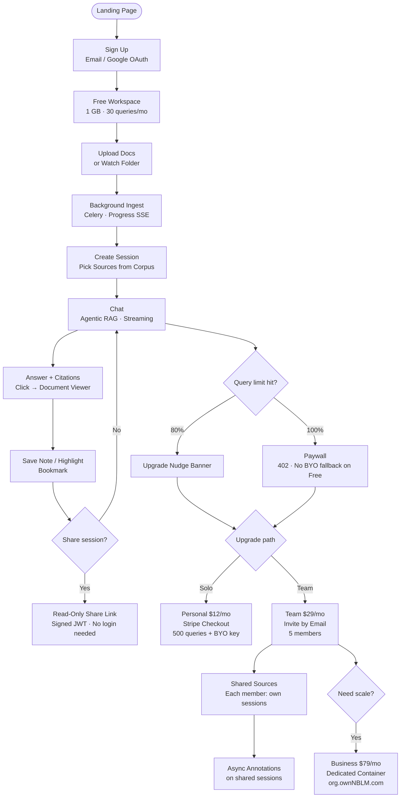
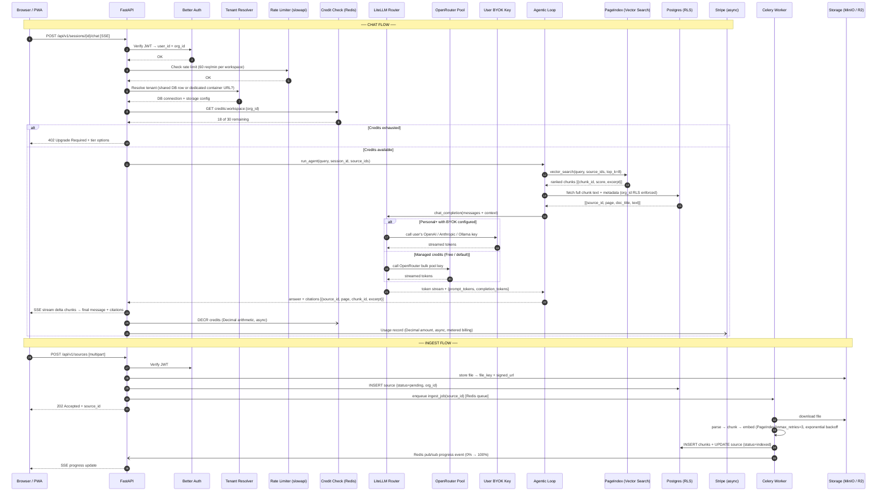

# ownNBLM — Larger Than Life SaaS Platform

## Production status

**Paused (June 2026).** Vercel serves a maintenance page only; VPS API/Postgres are stopped (`docker compose down`, volumes kept). Phase 4+ and Phase 5 are in `main`, plus hardening: Razorpay billing, folder watch (watchdog), Resend email, public API chat SSE, Playwright/Vitest CI, `/reference` → OpenAPI. Configure `RAZORPAY_*` and `RESEND_API_KEY` before billing/email in prod (Stripe optional).

**Resume:** see [ROADMAP.md](ROADMAP.md#resume-production-when-ready) and `scripts/unpause_prod.ps1`.

## Post-MVP roadmap (Phase 4+)

Detailed scope, deliverables, and acceptance criteria: **[ROADMAP.md](ROADMAP.md)**.

| Track | PLAN todo | Summary |
|-------|-----------|---------|
| Phase 4 | `auth-better-auth` | Better Auth: Google OAuth, magic link, workspace invites |
| Phase 4 | `hybrid-provisioner` | Business tier dedicated containers (Portainer + Traefik) |
| Phase 4 | `admin-console` | Members, storage, API keys, audit log, billing portal |
| Phase 4 | `team-annotations` | Shared sources, session annotations, weekly digest |
| Phase 5 | `public-api` | Public REST API v1, webhooks, OpenAPI, citation export |

## Strategic Positioning

**ICPs (prioritized):**
- ICP-1: Individual researcher/analyst/consultant — frictionless solo trial, managed credits, zero config
- ICP-2: Small professional team (5–15) — shared corpus workspace, read-only session sharing, per-workspace billing

**Revenue model:**
- Workspace subscription (base fee) + overage credits (usage beyond tier)
- ownNBLM buys OpenRouter capacity in bulk → resells as managed query credits (30–40% margin)
- Free tier hits paywall at 30 queries — no BYOK fallback at any tier except Enterprise
- BYOK = Enterprise-only privilege (they pay for the platform; we don't margin their LLM calls)

---

## Tier Structure

| Tier | Price | Storage | Managed Queries/mo | Users | BYOK | Instance |
|------|-------|---------|--------------------|-------|------|----------|
| Free | $0 | 1 GB | 30 — paywall after | 1 | No | Shared |
| Personal | $12/mo | 10 GB | 500 | 1 | No | Shared |
| Team | $29/mo | 50 GB pooled | 2 000 pooled | Up to 5 | No | Shared |
| Business/Enterprise | $79/mo | 200 GB | 10 000 | Up to 20 | **Yes** | Dedicated container |
| Overage credits | — | — | $0.99 / 500 queries | — | — | — |

Premium model queries (GPT-4o, Claude 3.5 Sonnet) = 5× credit cost. Default managed model = `openai/gpt-4o-mini` (fast, cheap, capable). All tiers Free–Team go exclusively through ownNBLM's managed OpenRouter pool — no BYOK until Enterprise.

---

## Critical Engineering Rules

- **Money/credits always use `Decimal`** — never `float` for any billing, credit balance, overage, or Stripe amount. Python `decimal.Decimal` throughout `credits.py`, `billing.py`, everywhere a currency or credit count is computed or compared. No exceptions.
- **Rate limiting on every public endpoint** — `slowapi` (FastAPI) per IP + per `workspace_id`. Chat: 60 req/min. Ingest: 10 req/min. Auth: 5 req/min.
- **HTTPS enforced in prod** — Traefik handles TLS (Let's Encrypt); HTTP → HTTPS redirect always on.
- **CORS locked** — explicit origin whitelist; no `*` wildcard in production.
- **Celery task retries** — all ingest jobs: `max_retries=3`, exponential backoff (`countdown=2**attempt`). Dead-letter queue (`ingest.dead`) logs final failure + notifies user via SSE.
- **No BYOK below Enterprise** — LiteLLM router must hard-reject `api_key` overrides for Free/Personal/Team workspaces. Validate tier in router middleware, not just UI.

---

## Architecture Decisions (set in Phase 1, don't rework later)

- **Postgres from day 1** with `org_id` + `user_id` on every table; SQLAlchemy + Alembic migrations
- **Row-level security (RLS)** in Postgres for shared-tier data isolation
- **Storage abstraction layer**: `StorageBackend` interface — `LocalDiskBackend` for dev, `S3Backend` (R2/MinIO) for prod
- **Auth-aware API from day 1**: every endpoint takes `current_user` — dev mode has a passthrough stub
- **Workspace/org schema** built even when only 1 org exists in dev
- **LiteLLM router** as single entry point: routes to managed OpenRouter pool OR user-supplied BYOK; emits usage events to metering service
- **Usage metering**: Redis counters (per `workspace_id`, reset monthly via cron); overflow → Stripe metered billing
- **Celery + Redis** for async ingest jobs (document processing queue)
- **PageIndex** as editable sibling dep (`../PageIndex`) — not pinned to PyPI

## Stack

- **Backend**: FastAPI + SQLAlchemy 2 + Alembic + Celery + Redis
- **Phase 1 DB**: SQLite (zero-dep, single-user, runs on 256MB RAM) → Postgres from Phase 3 (multi-tenant SaaS)
- **Frontend**: React 19 + Vite + TailwindCSS v4 + shadcn/ui (blocks: `sidebar-07`, `dashboard-01`, `login-01`)
- **Auth**: Better Auth (email/password + Google OAuth + magic link)
- **Payments**: Stripe (subscriptions + metered overage)
- **Storage**: Local disk (Phase 1–2) → MinIO (self-hosted VPS) → Cloudflare R2 (managed cloud)
- **LLM**: LiteLLM → OpenRouter managed pool; BYOK only wired for Enterprise tier
- **Mobile**: PWA via Workbox (service worker, offline caching, Add to Home Screen)
- **Multi-tenant provisioning**: Portainer CE API (spin up dedicated Compose stack per Business org)
- **Task queue Phase 1**: Huey with SQLite backend (zero Redis dependency) → Celery + Redis from Phase 3

## VPS Resource Targets

| Component | Phase 1 (SQLite/Huey) | Phase 3+ (Postgres/Celery) |
|-----------|-----------------------|---------------------------|
| FastAPI worker | < 120MB RSS | < 150MB RSS |
| Task worker | < 80MB RSS (Huey) | < 120MB RSS (Celery) |
| DB | SQLite (file) | Postgres 64MB `shared_buffers` |
| Cache/Queue | None | Redis 64MB `maxmemory` LRU |
| Storage | Local disk | MinIO or R2 |
| **Total stack** | **< 300MB RAM** | **< 700MB RAM** |

Phase 1 runs comfortably on a $4/mo VPS (1 vCPU, 512MB RAM). Phase 3 needs 2GB RAM minimum.

---

## Design System & CX (shadcn + ui-ux-pro-max recommended)

**Visual identity**: Research-grade, calm, focused. Think Obsidian + Perplexity. Users spend hours in this app.

**Typography** (from ui-ux-pro-max recommendation for academic/research tools):
- Headings: `Crimson Pro` (scholarly, warm serif)
- UI text: `Atkinson Hyperlegible` (designed for readability, accessibility)
- Code / citations: `JetBrains Mono`
- Google Fonts import in `globals.css`

**Color tokens (CSS variables, both modes):**

```css
/* Dark (default) */
:root {
  --background: 222 47% 4%;        /* #080B12 near-black blue */
  --surface:    222 47% 7%;        /* #0F1420 card surface */
  --border:     222 30% 14%;       /* #1A2235 subtle border */
  --accent:     217 91% 60%;       /* #2563EB blue — from ui-ux-pro-max CTA */
  --accent-fg:  0 0% 100%;
  --muted:      215 16% 47%;       /* #64748B slate muted */
  --text:       210 40% 90%;       /* #E2EAF4 soft white */
  --destructive:0 84% 60%;
}
.light {
  --background: 210 40% 98%;       /* #F8FAFC */
  --surface:    0 0% 100%;
  --border:     214 32% 91%;       /* #E2E8F0 */
  --accent:     217 91% 60%;       /* same blue */
  --text:       222 47% 11%;       /* #1E293B */
}
```

**Component scaffolding (shadcn blocks — run once in dev session):**
```bash
npx shadcn@latest add sidebar-07      # collapsible sidebar with icon rail
npx shadcn@latest add dashboard-01    # main content area layout
npx shadcn@latest add login-01        # auth form
```

**Animations (Framer Motion — purposeful, not decorative):**
- Chat message appear: `opacity 0→1, y +8→0, 150ms ease-out`
- Streaming tokens: no animation — raw SSE typewriter is the animation
- Panel open/close: `width 0→280px, 200ms ease-in-out`
- Ingest progress bar: smooth fill, `transition: width 300ms ease`
- Skeleton loading: shimmer `@keyframes shimmer` on gray placeholder blocks
- Upgrade modal: `scale 0.95→1, opacity 0→1, 180ms spring`

**Key UX moments (design these screens first, before any other UI):**
1. **Empty state / onboarding** — drag-drop zone, "Drop your first PDF here", animated dashed border pulse
2. **Ingest progress card** — file name, step label ("Chunking…", "Embedding…"), animated progress bar 0–100%
3. **First cited answer** — answer text streams in; citation chips slide up from bottom; "Click to view source" tooltip
4. **Query limit warning** — inline banner in chat: "You've used 24/30 queries. Upgrade for more →"
5. **Paywall hit (402)** — modal with tier comparison table, not a dead end — pre-fill Stripe checkout
6. **Share link copied** — toast with link preview, 2-second auto-dismiss

**Accessibility & quality gates (pre-delivery checklist from ui-ux-pro-max):**
- No emojis as icons — use Lucide SVG only
- `cursor-pointer` on all interactive elements
- Hover: `transition 150–300ms ease`
- Light mode text contrast ≥ 4.5:1 (WCAG AA)
- Focus rings visible (keyboard nav)
- `prefers-reduced-motion` respected — wrap all Framer Motion in `useReducedMotion` check
- Responsive breakpoints tested: 375px, 768px, 1024px, 1440px

---

## Resource Constraints & Ingestion Throttling

**Ingest limits (enforced at API + Celery level):**
- Max file size: 50 MB per file
- Max files per batch upload: 10
- Max concurrent ingest jobs per workspace: 3 (env: `MAX_CONCURRENT_INGEST=3`)
- Ingest rate limit: 5 files/minute per workspace
- Chunk size: 512 tokens, 64-token overlap (configurable via env)
- Embedding batch size: 32 chunks per API call (avoid timeouts)
- SSE chat timeout: 120 seconds (LLM hard cutoff; inform user gracefully)

**Progress monitoring (SSE events emitted by Celery worker):**
```json
{ "event": "ingest_progress", "source_id": "...", "pct": 25, "step": "Chunking text" }
{ "event": "ingest_progress", "source_id": "...", "pct": 50, "step": "Generating embeddings" }
{ "event": "ingest_progress", "source_id": "...", "pct": 90, "step": "Storing index" }
{ "event": "ingest_done",     "source_id": "...", "chunks": 184, "elapsed_ms": 2300 }
{ "event": "ingest_error",    "source_id": "...", "reason": "File too large" }
```

**Credit threshold events (SSE to client):**
```json
{ "event": "credit_warning", "used": 24, "limit": 30, "pct": 80 }
{ "event": "credit_exhausted", "upgrade_url": "/billing/upgrade" }
```

**Storage quota enforcement:**
- Checked before every upload: `if org_storage_used + file_size > tier_limit: reject 413`
- Storage usage cached in Redis (`storage:org:{id}`) updated on ingest_done + source_delete

---

## Developer Experience & Seed Data

**Non-technical developer assumption**: this app must bootstrap itself. Running it should require zero manual steps beyond filling `.env`.

**Makefile targets:**
```makefile
make dev       # docker-compose up --build (Phase 1: SQLite stack)
make seed      # python -m app.seed — creates default user, workspace, loads sample PDF
make test      # pytest + vitest (all tests)
make lint      # ruff + mypy + eslint
make migrate   # alembic upgrade head
make health    # curl /health and print status table
make reset     # drop DB + re-seed (dev only)
```

**Seed script (`app/seed.py`) — creates immediately testable state:**
- Default org: `"My Research"` (org_id deterministic for dev)
- Default user: `admin@ownnblm.local` / `admin123` (dev mode only, rejected in prod)
- OpenRouter key: read from `.env` — **required**; seed fails with clear message if missing
- Sample PDF: bundled `fixtures/sample_research_paper.pdf` — indexed automatically
- Seed is **idempotent** (safe to re-run)

**`.env.example` — every var documented inline:**
```ini
# Required
OPENROUTER_API_KEY=sk-or-...       # get from openrouter.ai — no BYOK option in app until Enterprise

# Optional (Phase 1 defaults shown)
DATABASE_URL=sqlite:///./ownNBLM.db
STORAGE_BACKEND=local              # local | s3
STORAGE_LOCAL_PATH=./data/files
DEFAULT_LLM_MODEL=openai/gpt-4o-mini
DEFAULT_EMBED_MODEL=openai/text-embedding-3-small
MAX_CONCURRENT_INGEST=3
MAX_FILE_SIZE_MB=50
LOG_LEVEL=INFO
ENVIRONMENT=development            # development | production
SECRET_KEY=change-me-in-production
```

**Health check endpoint `GET /health` returns:**
```json
{
  "status": "ok",
  "checks": {
    "database": "ok",
    "storage": "ok",
    "openrouter": "ok",        // pings OpenRouter /models
    "task_queue": "ok"
  },
  "version": "0.1.0",
  "environment": "development"
}
```

---

## Testing, CI & Observability (CTO/QA hat)

**Testing strategy:**
- Unit tests (pytest / Vitest): all `services/` modules; credit arithmetic especially (`Decimal` edge cases: rounding, overflow, zero)
- Integration tests (pytest + FastAPI `TestClient`): every API route with auth + tier enforcement
- E2E (Playwright): 5 critical flows — signup → ingest → chat → citation click → share link
- Regression: Playwright screenshots diffed on every PR (visual regression)
- Coverage targets: services 85%, API routes 70%, frontend components 60%

**CI pipeline (GitHub Actions):**
```
on: push / PR
jobs:
  lint:   ruff check + mypy + eslint
  test:   pytest (backend) + vitest (frontend)
  e2e:    playwright (headed=false, Docker Compose test stack)
  build:  docker build (smoke test)
```

**Observability:**
- Structured logging: `structlog` — JSON in prod, colorized in dev
- Metrics: `prometheus-fastapi-instrumentator` → `/metrics` endpoint
- Error tracking: Sentry (opt-in via `SENTRY_DSN` env var)
- Every ingest job logs: `{source_id, org_id, duration_ms, chunk_count, error?}`
- Every LLM call logs: `{workspace_id, model, prompt_tokens, completion_tokens, latency_ms, credit_cost}` (Decimal)
- Request ID header (`X-Request-ID`) threaded through all logs

---

## Phase 1 — Foundation (Weeks 1–4)
**Goal**: Fully working OpenRouter RAG chat on `make dev`. Single user. No auth friction. Zero external dependencies beyond `OPENROUTER_API_KEY`.

**Definition of done for Phase 1**: `make dev && make seed` → open `localhost:5173` → pre-logged-in as `admin@ownnblm.local` → sample PDF already indexed → ask a question → get a streaming answer with citations → click citation → document viewer opens. This must work before Phase 2 starts.

- Monorepo scaffold: `backend/` (FastAPI + SQLAlchemy + Alembic), `frontend/` (React 19 + Vite + shadcn), `docker-compose.yml`, PageIndex as editable sibling dep (`pip install -e ../PageIndex`)
- **SQLite for Phase 1** (zero ops overhead); Alembic migrations written to be Postgres-compatible from day 1
- **Huey task queue** with SQLite backend (no Redis needed in Phase 1)
- DB schema: `orgs`, `users`, `sources`, `documents`, `chunks`, `sessions`, `messages` — `org_id` FK on every table, org-scoped from day 1
- Source registry: local folder watch (watchdog), manual file upload, URL sources (Phase 2)
- Ingest pipeline: PDF/MD via PageIndex; DOCX via mammoth; TXT normalization to MD sections; 512-token chunks, 64-token overlap; batch embed via OpenRouter `text-embedding-3-small`
- Ingest progress SSE: Huey worker emits `ingest_progress` events → Redis-free pub/sub via SQLite polling (Phase 1) → proper Redis pub/sub from Phase 3
- Agentic RAG loop: port from `agentic_vectorless_rag_demo.py`; corpus tools + scoped session doc filtering; LiteLLM → OpenRouter managed pool only; default model `openai/gpt-4o-mini`
- Citation payloads: `{source_id, page, chunk_id, text_excerpt}` — deep-link viewer route
- Streaming SSE chat API (FastAPI `StreamingResponse`)
- Dev auth stub: `X-Dev-User-Id: admin` header bypasses JWT in `ENVIRONMENT=development`
- **Seed script** (`app/seed.py`): creates default org + user + indexes `fixtures/sample_research_paper.pdf`; idempotent; verifies `OPENROUTER_API_KEY` is set before running
- **Health check** `GET /health` covering DB + storage + OpenRouter connectivity
- **Makefile** with `dev`, `seed`, `test`, `lint`, `migrate`, `health`, `reset`
- Design: Phase 1 UI uses shadcn `sidebar-07` + `dashboard-01` blocks; dark mode default; Crimson Pro + Atkinson Hyperlegible loaded; skeleton loading states; streaming typewriter chat

## Phase 2 — Sessions, Scoped Context & Sharing (Weeks 5–7)
**Goal**: Multi-doc sessions, read-only sharing, polished UI.

- Multi-select corpus → session (user picks which sources are "in scope" for a session)
- Parallel session chats (tabbed interface)
- Notes / highlights / bookmarks per session (stored in DB, exportable as MD)
- **Read-only share links**: signed JWT URL → public read view of a session (no auth required to view)
- Markdown rendering, chart rendering (Recharts), document viewer side panel
- Sources panel with ingest status, re-index action, delete

## Phase 3 — Auth, Cloud & Monetization (Weeks 8–13)
**Goal**: Paying customers possible. Cloud-deployable.

- **Better Auth**: email/password + Google OAuth + magic link; JWT sessions; `org_id` attached at login
- **Workspace model**: org creation, invite by email (pending invite table), member roles (owner/member)
- **Stripe integration**:
  - Products: Free, Personal, Team, Business
  - Metered add-on: overage credits (Stripe Usage Records API)
  - Customer Portal for self-service plan changes
  - Webhooks: `subscription.updated`, `invoice.payment_succeeded/failed`
- **Managed LLM credit system**:
  - Redis counter `credits:workspace:{id}` reset monthly by cron
  - LiteLLM emits `usage_event` on each call → credit deduct + Stripe metered record
  - Upgrade prompt when 80% / 100% depleted
  - BYOK path available for Personal+ (bypasses credit counter)
- **Hybrid tenancy provisioner** (Business tier):
  - Portainer CE API: `POST /api/stacks` to spin up dedicated Compose stack for new Business org
  - Stack template: FastAPI + Celery + Postgres + MinIO + Redis per org
  - DNS: `{org-slug}.ownNBLM.com` → Traefik proxy
- **Storage**: MinIO for VPS self-hosted; env-switch to R2 for managed cloud
- **PWA**: Workbox service worker, offline session browsing, Add to Home Screen manifest
- **Usage dashboard**: queries used / storage used / plan limits for user-facing self-service

## Phase 4 — Team Polish & Admin Console (Weeks 14–17)
**Goal**: Teams self-manage without you touching anything.

- Admin console: member list, remove/reinvite, storage per member, API key rotation
- Billing portal link (Stripe Customer Portal embedded)
- Team shared sources: sources visible to all workspace members by default (with per-source private option)
- Async annotations: members can add sticky comments to shared read-only sessions
- Email digest: weekly "You made N queries, key topics: X, Y, Z" (via Resend/Postmark)
- Org audit log: who accessed what session, when (DB table `audit_events`)

## Phase 5 — API Ecosystem (Weeks 18+)
**Goal**: Developer ICP, B2B integrations, enterprise prep.

- Public REST API: same FastAPI backend, versioned under `/api/v1/`
- API key management (scoped: read-only, ingest, full)
- Webhook outbound: `session.answer_generated`, `source.indexed`
- OpenAPI docs hosted at `docs.ownNBLM.com`
- Citation export: Zotero/Bibtex/RIS format download from session
- SOC 2 / GDPR groundwork: data export endpoint, right-to-erasure job, audit log retention policy

---

## Non-Goals (explicitly deferred)
- White-label / reseller branding — after PMF
- Native iOS/Android apps — PWA first; revisit at 10K MAU
- HIPAA / healthcare compliance — certify when first enterprise demands it
- Real-time co-editing (Google Docs-style) — read-only share is sufficient for ICP-2

---

## Key Files / Entrypoints

**Backend**
- `backend/app/seed.py` — idempotent seed: default org + user + sample PDF indexed; requires `OPENROUTER_API_KEY`
- `backend/app/core/config.py` — all env vars, typed via Pydantic Settings
- `backend/app/core/tenancy.py` — hybrid tenant resolver (shared DB row vs dedicated container URL)
- `backend/app/services/credits.py` — LLM credit metering, counters, Stripe usage records (**`Decimal` only — no float**)
- `backend/app/services/llm.py` — LiteLLM router: managed OpenRouter pool for all tiers; BYOK wired only when `workspace.tier == "enterprise"`
- `backend/app/services/ingest.py` — pipeline: parse → chunk → embed → store; emits progress SSE events
- `backend/app/services/provisioner.py` — Portainer API wrapper for Business tier container provisioning
- `backend/app/api/v1/` — all versioned API routes, auth-guarded
- `backend/app/api/health.py` — `GET /health` checks DB + storage + OpenRouter

**Frontend**
- `frontend/src/styles/globals.css` — CSS variable tokens (dark + light mode), Crimson Pro + Atkinson Hyperlegible imports
- `frontend/src/features/chat/` — streaming SSE chat, citation chips, typewriter rendering
- `frontend/src/features/ingest/` — upload zone, progress card (SSE-driven), error states
- `frontend/src/features/billing/` — upgrade prompts, credit warning banner, Stripe portal redirect
- `frontend/src/features/viewer/` — document viewer side panel, citation deep-link scroll

**Infrastructure**
- `Makefile` — `dev`, `seed`, `test`, `lint`, `migrate`, `health`, `reset`
- `.env.example` — every variable documented inline
- `docker-compose.yml` — Phase 1–2 dev stack (SQLite/Huey, single container)
- `docker-compose.saas.yml` — Phase 3+ SaaS stack (Postgres + Redis + Celery + Traefik)
- `docker-compose.tenant.yml` — per-org dedicated stack template (Business tier)
- `fixtures/sample_research_paper.pdf` — bundled for seed script

---

## User Journey



---

## Technical Backend Journey



