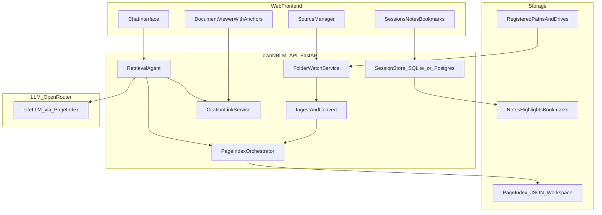
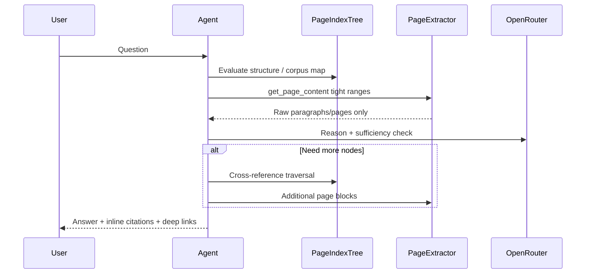
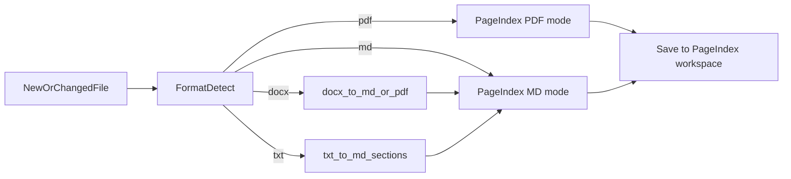

# ownNBLM — NotebookLM-Style Grounded Learning Platform

## Starting point

[`ownNBLM/chat context - requirement gathering.md`](c:\Users\mayur\Downloads\AppDevelopment\ownNBLM\chat context - requirement gathering.md) defines the core retrieval philosophy:

- **No vector DB** — hierarchical PageIndex trees as a map, on-demand page/section extraction
- **Iterative agent loop** — tree search → fetch only relevant pages → sufficiency check → multi-citation answers
- **Resource-light** — index JSON on disk; CPU/RAM spike only during indexing and queries

You already have a working PageIndex install at [`../PageIndex`](c:\Users\mayur\Downloads\AppDevelopment\PageIndex) with `PageIndexClient`, agent demo ([`examples/agentic_vectorless_rag_demo.py`](c:\Users\mayur\Downloads\AppDevelopment\PageIndex\examples\agentic_vectorless_rag_demo.py)), and sample indexed trees in `results/`. **ownNBLM will wrap this engine in a first-class web product** rather than relying on Grimmory + Cursor MCP alone.

Sibling [`SurfSense`](c:\Users\mayur\Downloads\AppDevelopment\SurfSense) is useful as **UX reference** (notebooks, folder watch, citations) but its Neo4j/vector stack is explicitly out of scope per your chat context.

---

## Product architecture



### Two query modes (your core UX split)

| Mode | User action | Agent scope | Index used |
|------|-------------|-------------|------------|
| **Corpus Query** | Ask across all registered folders/drives | Full corpus meta-index + per-doc trees | PageIndex File-System layer: lightweight `_meta.json` corpus map → route to doc → tree search |
| **Scoped Session** | Pick N documents → open dedicated chat | Fixed doc_id set for session lifetime | Same tools, but agent tools filtered to session's doc list; multiple parallel sessions allowed |

Both modes share the same retrieval loop described in your chat context:



---

## Tech stack (recommended)

| Layer | Choice | Rationale |
|-------|--------|-----------|
| Backend | **Python 3.11+ FastAPI** | Same language as PageIndex; async streaming; easy Windows + Linux deploy |
| Retrieval core | **PageIndexClient** from sibling repo (editable install) | Already supports PDF + MD; proven agentic demo |
| LLM | **OpenRouter via LiteLLM** | You chose OpenRouter; PageIndex already routes non-OpenAI models through `litellm/` prefix |
| Local DB | **SQLite** (Windows MVP) | Sessions, sources, bookmarks, index job status |
| Cloud DB | **PostgreSQL** (same schema via SQLAlchemy) | Drop-in when deploying to VPS |
| File watch | **watchdog** | Cross-platform folder monitoring; poll fallback for network/external drives |
| Word ingest | **mammoth** (.docx → structured HTML/MD) or **LibreOffice headless** (.doc/.docx → PDF) | PageIndex needs hierarchy; mammoth is lighter for MVP |
| Plain text | Normalize to Markdown with synthetic `#` sections (by blank-line blocks or fixed line windows) | Feeds existing `md_to_tree` path |
| Frontend | **React + Vite** (or Next.js static export) | Fast local dev; markdown/charts via **react-markdown**, **remark-gfm**, **Mermaid**, **Recharts** |
| Deploy local | Single `docker compose` or `ownnblm serve` CLI | Bundles API + static UI; mounts user folders |
| Deploy cloud | Same compose on 2–4 GB VPS; optional reverse proxy (Caddy) | Matches chat context resource profile |

**Grimmory is optional, not required.** Your vision (multi-root folders, external drives, session chat) is better served by a built-in **Source Registry** than a separate book library app.

---

## Data model (minimal)

**sources** — registered roots (`path`, `label`, `watch_enabled`, `last_scan_at`)

**documents** — `doc_id`, `source_id`, `relative_path`, `format`, `pageindex_workspace_ref`, `index_status`, `file_hash`, `mtime`

**sessions** — `session_id`, `name`, `mode` (`corpus` | `scoped`), `doc_ids[]`, `created_at`

**messages** — chat history per session with stored citation payloads

**annotations** — `session_id`, `doc_id`, `anchor` (page/line range), `type` (`note` | `highlight` | `bookmark`), `content`, `created_at`

**index_jobs** — background queue for (re)indexing on file change

---

## Ingest pipeline (MVP formats: PDF, Word, Markdown, text)



- **Re-index trigger**: file hash + mtime change from watchdog
- **External drives (Windows)**: register `D:\`, `E:\` etc. as source roots; use polling interval (e.g. 60s) when OS watch is unreliable on removable media
- **Cloud**: mount folders via volume mounts or sync agent (Phase 4); same ingest code

---

## Citation and document links

Every agent answer returns structured citations:

```json
{
  "doc_id": "...",
  "doc_name": "Q1 Report.pdf",
  "page_start": 44,
  "page_end": 48,
  "excerpt": "...",
  "deep_link": "/viewer/{doc_id}?page=44",
  "download_link": "/api/documents/{doc_id}/file?token=..."
}
```

- **Viewer route**: in-app PDF/page viewer scrolled to anchor; MD/txt scroll to line
- **Temporary signed URLs**: short-lived JWT for raw file download (share/export)
- **Inline response**: markdown footnotes linking to viewer panes

Reuse PageIndex tools from the demo:

```python
# Pattern from agentic_vectorless_rag_demo.py
get_document()           # metadata
get_document_structure()   # tree map only
get_page_content(pages)  # tight range extraction
```

Extend with **corpus-level tools** for Mode 1:

- `list_corpus()` — read workspace `_meta.json` + folder paths
- `search_corpus(query_hint)` — lightweight keyword pass over doc descriptions + node summaries (optional fast pre-filter before tree reasoning)

---

## Web UI (NotebookLM-like surfaces)

1. **Sources panel** — add folder/drive, show index status, file tree, re-index button
2. **Chat panel** — streaming markdown; citation chips open viewer side-by-side
3. **Session switcher** — create scoped session from checked documents; corpus mode as default "All sources"
4. **Learning rail** — notes, highlights, bookmarks filtered to active session
5. **Settings** — OpenRouter model picker, API key, watch intervals

Rich output conventions (agent system prompt + post-processing):

- Tables via GFM markdown
- Charts: agent emits fenced `chart` JSON blocks → Recharts renderer
- Diagrams: Mermaid blocks for concept maps

---

## OpenRouter configuration

In backend `.env`:

```
OPENROUTER_API_KEY=...
OPENROUTER_MODEL=openrouter/anthropic/claude-sonnet-4  # example; user-configurable
```

PageIndex config ([`pageindex/config.yaml`](c:\Users\mayur\Downloads\AppDevelopment\PageIndex\pageindex\config.yaml)) — set `retrieve_model` to OpenRouter path; indexing model can be a cheaper OpenRouter model, retrieval model a stronger one.

---

## Deployment profiles

### Local Windows (primary MVP target)

- `ownnblm init` — creates `%USERPROFILE%\.ownnblm\` workspace + SQLite DB
- `ownnblm serve --port 8787` — opens browser to local UI
- User adds `C:\Users\...\Documents\Research`, `D:\Books`, etc.
- Optional: Windows service / Task Scheduler for background watch

### Cloud VPS

- Docker Compose: `api`, `web` (nginx static), `postgres` (optional)
- Volume mounts for document roots or SFTP/sync
- Same API; multi-user auth added in Phase 4 (JWT + per-user source ACL)

Resource estimate (from chat context, still valid): **2–4 GB RAM VPS** with OpenRouter handling LLM compute; PageIndex idle footprint near zero.

---

## Phased delivery

### Phase 1 — Core engine + local web MVP (4–6 weeks)

Build in [`ownNBLM/`](c:\Users\mayur\Downloads\AppDevelopment\ownNBLM):

```
ownNBLM/
  backend/          # FastAPI, ingest, agent, PageIndex wrapper
  frontend/         # React chat + source manager
  docker-compose.yml
  README.md
```

Deliverables:

- Register folders, watchdog ingest
- Index PDF, MD, DOCX, TXT via pipeline above
- Corpus chat (Mode 1) with streaming answers + page citations + viewer
- OpenRouter integration

### Phase 2 — Scoped sessions + learning annotations (2–3 weeks)

- Document multi-select → scoped session
- Multiple concurrent sessions with frozen doc sets
- Notes, highlights, bookmarks stored per session
- Export session summary as Markdown

### Phase 3 — Speed, polish, multi-root scale (2–3 weeks)

- Corpus meta-index (PageIndex File System pattern from [PageIndex blog](https://pageindex.ai/blog/pageindex-filesystem))
- Index job queue + incremental re-index
- Response streaming optimizations (parallel page fetches, cache hot nodes)
- External drive polling + cloud folder mounts

### Phase 4 — Cloud multi-user + sharing (3–4 weeks)

- Postgres, auth, per-user workspaces
- Signed share links for citations and session exports
- HTTPS deploy template (Caddy + compose)

### Phase 5 — Learning artifacts (future)

- Flashcards / spaced-repetition decks from session annotations
- Slide deck generation (python-pptx or Marp markdown → PPT)
- Excel/PPT ingest (LibreOffice conversion → PDF/MD index path)
- Optional NotebookLM-style audio overview (TTS pipeline)

---

## Key risks and mitigations

| Risk | Mitigation |
|------|------------|
| PageIndex OSS is PDF/MD-native; Word hierarchy loss | Prefer mammoth → MD with heading preservation; fallback LibreOffice → PDF for complex DOCX |
| OpenRouter latency on multi-hop retrieval | Stream partial answers; cap tool loops; cache structure trees in memory |
| External drive watch unreliable | Polling + manual "Scan now" |
| Large corpora tree search slow | Corpus `_meta.json` pre-filter; index doc descriptions; lazy-load structures |
| Complex PDFs (scanned) | Flag for PageIndex Cloud OCR later; MVP warns on low text extraction quality |

---

## What we are NOT building in MVP

- Vector DB / Neo4j (explicitly avoided per chat context)
- Grimmory dependency (superseded by built-in source manager)
- Excel/PPT (Phase 5)
- Google NotebookLM cloud dependency

---

## Success criteria for MVP

- Add a Windows folder with mixed PDF/DOCX/MD/TXT; files auto-index within minutes
- Ask a cross-document question; get answer in **&lt;30s** typical with citations linking to exact pages/sections
- Create a scoped session with 3 documents; ask follow-ups without corpus bleed
- Save a bookmark with anchor; reopen in viewer from session rail
- Same binary runs locally and on a VPS with OpenRouter key only
